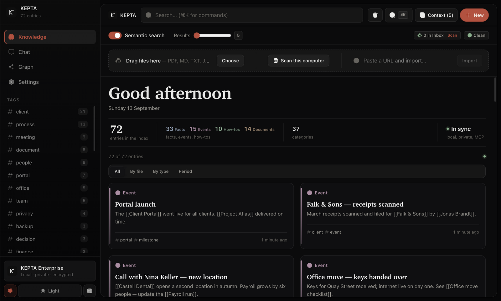
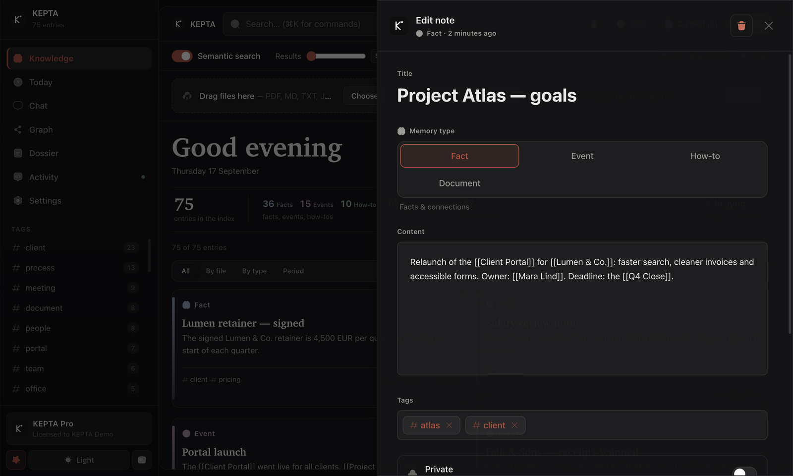

<p align="center">   <a href="https://www.linkedin.com/in/damian-todorovic-244235434"></a></p>

# KEPTA Core — deutsches Readme

Dein KI-Assistent vergisst alles. Jeder Chat beginnt bei null.

KEPTA ändert das — **lokal**. Eine verschlüsselte SQLite-Datei auf deinem Rechner. Keine Cloud, kein Konto, keine Telemetrie. Dein Assistent liest und schreibt sie über **MCP** (Claude Desktop, Cursor, jeder MCP-Client) oder eine kleine **HTTP-API**.

> **Dies ist der offene Kern** (AGPL-3.0): Memory-Engine, MCP-Server, HTTP-API — dazu der Python-Client unter MIT, damit ihn jedes Python-Projekt einbauen kann. Die vollständige Desktop-Anwendung ist **KEPTA Enterprise** — siehe unten. English: [README.md](README.md).

## 🚀 KEPTA Enterprise — die ganze Desktop-App

**Mit diesem Kern sprechen deine Agenten. In KEPTA Enterprise arbeitest _du_.** Eine native App für macOS, Windows und Linux, die dieselbe verschlüsselte Wissensbasis in ein zweites Gehirn verwandelt, das du sehen, durchsuchen, ordnen und dem du vertrauen kannst — jedes Dokument, jede Entscheidung, jede Verbindung, auf deinem eigenen Rechner.

| Der Index — alles, was du weißt, nach Art geordnet | Der Wissensgraph — jede Notiz ein Knoten, jeder Link eine Kante |
|---|---|
|  |  |
| **Der Editor — Wissensart, `[[Links]]`, Gültigkeit** | **In einer Minute eingerichtet — deine Worte, kein Menü** |
|  |  |

<sub>KEPTA Enterprise 2.11 mit einem erfundenen Demo-Korpus — nichts auf diesen Bildern ist echt. Die Oberfläche ist englisch.</sub>

Was Enterprise über den Kern hinaus mitbringt:

- **Native Desktop-App** für macOS, Windows und Linux
- **Wissensgraph zum Erkunden** — Kräfte-Layout und Baumansicht, ein Zeitregler zurück zu jedem Tag; 3 000 Knoten und 9 500 Kanten bei 60 fps
- **Import per Drag & Drop** — PDF, Markdown, Text; Obsidian-Vaults; Webseiten mit einem Einfügen
- **Diesen Rechner durchsuchen** — freiwillig, mit Vorschau, bevor auch nur eine Datei gelesen wird
- **Duplikat-Prüfung, Papierkorb mit Wiederherstellen, Befehlspalette** (⌘K)
- **Chat-Cockpit** mit dem Modell deiner Wahl — lokal (Ollama, LM Studio) oder in der Cloud
- **Praxis-Sync** — Wissen zwischen den eigenen Geräten verschieben, als verschlüsseltes Bundle
- **Einrichtungsassistent und Systemstatus**, die sagen, was läuft und was fehlt

**14 Tage kostenlos testen — voller Funktionsumfang, kein Konto, kein Internet.** Danach schaltet ein Lizenzschlüssel die App frei, geprüft offline auf deinem Rechner; KEPTA ruft nirgends an. Für dich, deine Praxis oder dein ganzes Team: **[schreib mir auf LinkedIn](https://www.linkedin.com/in/damian-todorovic-244235434)**.

## ⚡ Schnellstart

**1. MCP-Server** (Claude Desktop / Cursor / jeder MCP-Client):

```json
{
  "mcpServers": {
    "kepta": {
      "command": "npx",
      "args": ["-y", "kepta-mcp"]
    }
  }
}
```

**2. HTTP-API:**

```bash
npm install && npm run dev
# → http://127.0.0.1:3000
```

**3. Docker** (nur MCP-Server): `docker build -t kepta-mcp .`

**Zahlen:** **317 Tests** · 29 Routen · `npm run eval` — Eval auf 58 Notizen / 45 Anfragen (Hit@1, Precision@5, MRR).

## 🔐 Verschlüsselt auf der Platte

SQLCipher 4 (AES-256, HMAC-SHA512 je Seite, WAL eingeschlossen). Der Schlüssel liegt im Schlüsselbund des Betriebssystems, nie im Klartext auf der Platte. Details und wie du eine Kopie des Schlüssels aufbewahrst: [SECURITY.md](SECURITY.md).

## 🧪 Von der CI erzwungene Schwellen

| Bereich | Schwellen |
|---|---|
| alles zusammen | **70 %** der Zeilen · **72 %** der Funktionen · 56 % Branches · 66 % Statements |
| `src/core` | **87 %** der Zeilen · **89 %** der Funktionen · 74 % Branches · 85 % Statements |

## 👋 Wer KEPTA baut

KEPTA baut **Damian Todorovic**. Fragen, Ideen, eine Lizenz für dein Team — oder du willst einfach mitverfolgen, wohin das geht: **[finde mich auf LinkedIn](https://www.linkedin.com/in/damian-todorovic-244235434)**.

## 📄 Lizenz

[AGPL-3.0-or-later](LICENSE). **KEPTA Enterprise** — die Desktop-App mit grafischer Oberfläche, Wissensgraph, Rechner-Scan und Praxis-Sync — ist kommerzielle Software und separat lizenziert. Das npm-Paket `kepta-mcp` trägt dieselbe AGPL wie dieses Repository; der Python-Client unter `python/` ist MIT. Kommerzielle Lizenzierung des Kerns auf Anfrage — [schreib mir auf LinkedIn](https://www.linkedin.com/in/damian-todorovic-244235434).
