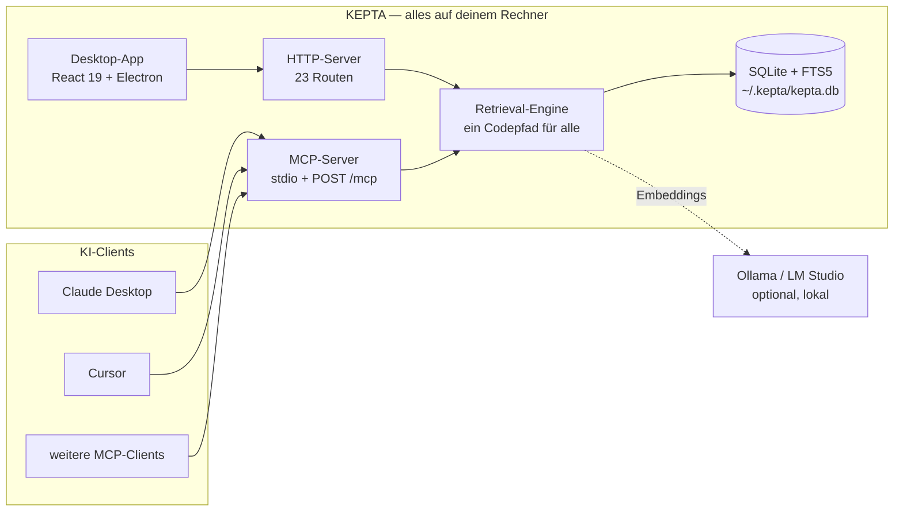
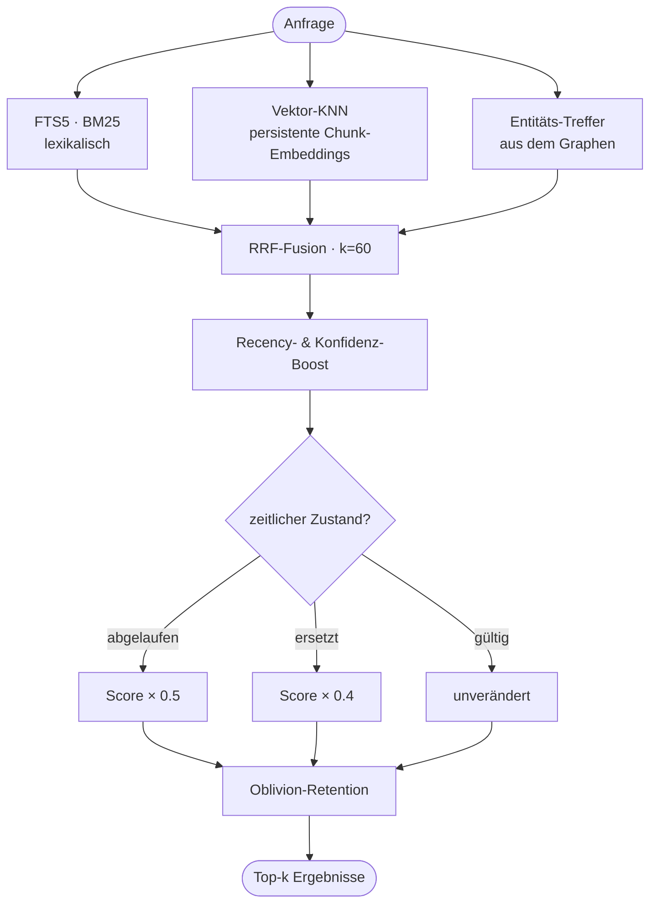

<p align="center"></p>
<h1 align="center">KEPTA — Behält, was zählt</h1>
<p align="center"><strong>Dein KI-Assistent vergisst dich nach jedem Gespräch.<br>KEPTA behält es — auf deinem eigenen Rechner, in einer Datei.</strong></p>

<p align="center"><sub>Open Source · ohne Cloud · ohne Konto · ohne Abo<br>SQLite · hybride Suche · Wissensgraph · MCP</sub></p>

<p align="center"><a href="README.md">🇬🇧 English</a> · <strong>Deutsch</strong></p>

> **Hinweis.** Diese Seite ist auf Deutsch — **die Oberfläche der App ist seit 2.6.0 englisch.** Deutsche Notizen funktionieren weiterhin: Die Suche kennt deutsche und englische Stoppwörter.

<p align="center"><a href="https://github.com/DamianTodorovic/kepta/releases"></a> <a href="https://github.com/DamianTodorovic/kepta/actions/workflows/build.yml"></a> <a href="https://www.npmjs.com/package/kepta-mcp"></a> <a href="https://pypi.org/project/kepta/"></a>   <a href="LICENSE"></a> </p>

## 🎬 Die ganze App in einem Durchgang

<p align="center"></p>

<sub>Ein kompletter Durchgang: Suche, Editor mit Typ und Gültigkeit, Notiz anlegen, Papierkorb mit Wiederherstellen, Wissensgraph samt Zeitregler, Chat-Cockpit, MCP-Endpunkte, Befehlspalette und Hell/Dunkel. Aufgenommen aus Version 2.6.3 mit erfundenen Demo-Daten. Die Oberfläche ist englisch.</sub>

| Index & hybride Suche | Wissensgraph |
|---|---|
|  |  |
| **Editor — Typ, Gültigkeit, Konfidenz** | **Einrichtung — Themen & Starter-Pack** |
|  |  |

<sub>Aufnahmen aus Version 2.6.0 mit erfundenen Demo-Daten — nichts davon ist echt. Die Oberfläche ist englisch.</sub>

### Wissen mit Datum

<p align="center"></p>

<sub>Der Zeitregler beantwortet, was die meisten Notiz-Apps nicht können: <em>Was wusste ich im November?</em> Jede Erinnerung trägt eine Gültigkeit, der Graph lässt sich damit zurückspulen. Die abgedunkelten Knoten sind nicht gelöscht — sie waren nur noch nicht wahr.</sub>

## 🙋 Neu hier? Fang damit an

**Das Problem.** Du benutzt ChatGPT, Claude oder etwas Ähnliches. Du erklärst dein Projekt, deinen Kunden, wie du Dinge gern hast. Am nächsten Tag öffnest du einen neuen Chat, und er weiß nichts davon. Also erklärst du es wieder. Und wieder.

**Was KEPTA ist.** Ein kleines Programm, das auf deinem eigenen Rechner läuft und sich diese Dinge für dich merkt. Dein Assistent kann selbst darin nachschlagen und Neues hineinschreiben. Nichts geht irgendwohin — die Notizen liegen in einer einzigen Datei bei dir, wie ein Dokument.

**Wie sich das im Alltag anfühlt.** Du sagst Claude, er solle sich merken, dass dein Kunde quartalsweise abrechnet. Zwei Wochen später, in einem völlig neuen Chat, fragst du nach der Rechnung — er weiß es bereits. Du legst ein PDF in einen Ordner, und dein Assistent kann daraus zitieren. Du ziehst um, und die alte Adresse kommt nicht mehr zurück.

**Ist das etwas für dich?**

- Du nutzt oft einen KI-Assistenten und wiederholst dich ständig → ja.
- Du willst, dass das, was du ihm erzählst, auf deinem Rechner bleibt → ja.
- Du suchst eine Notiz-App zum Selberschreiben → eher nicht. KEPTA ist dafür gebaut, dass dein *Assistent* sie benutzt.

### Muss ich Entwickler sein?

**Um die App zu benutzen — nein.** Datei für dein System herunterladen, öffnen, fertig. Es ist ein ganz normales Fenster: eine Liste, ein Suchfeld, eine Einstellungsseite. Welche Datei du brauchst, steht weiter unten.

**Um sie mit Claude Desktop oder Cursor zu verbinden — ein bisschen.** Du fügst einen kurzen Textblock in eine Konfigurationsdatei ein. Der Block steht fertig zum Kopieren unter *Einstellungen → MCP / API*. Wer so etwas noch nie gemacht hat, sollte sich für diesen einen Schritt zehn Minuten nehmen.

**Für die klügere Suche — freiwillig.** KEPTA sucht auch ohne alles einwandfrei. Installierst du [Ollama](https://ollama.com) — ein kostenloser Download —, findet es zusätzlich Notizen, die dasselbe mit anderen Worten sagen.

<details>
<summary><strong>Die Fachwörter auf dieser Seite, in normaler Sprache</strong></summary>

| Wort | Was es hier bedeutet |
|---|---|
| **Agent** | Ein KI-Programm, das Werkzeuge benutzen kann statt nur zu antworten — etwa Claude Desktop oder Cursor. |
| **MCP** | Eine vereinbarte Sprache, in der solche Programme mit Werkzeugen reden. KEPTA spricht sie, deshalb können diese Assistenten deine Notizen lesen und schreiben. |
| **SQLite** | Eine Datenbank, die einfach eine Datei auf der Festplatte ist. Nichts zu starten, nichts anzumelden; du kannst sie kopieren wie ein Foto. |
| **Embedding / Vektor** | In Zahlen übersetzter Text, damit ein Rechner erkennt, dass „Autowerkstatt" und „Garage" fast dasselbe meinen. |
| **BM25 / Volltext** | Klassische Stichwortsuche: Sie findet die Wörter, die du wirklich getippt hast. |
| **Wissensgraph** | Deine Notizen untereinander verknüpft, wie `[[Links]]` in einem Wiki. |
| **RRF** | Die Formel, die die drei Suchen oben zu einer Rangfolge zusammenführt. |
| **Local-first** | Alles passiert auf deinem Rechner. Kein Upload, kein Konto, kein Abo. |
| **Open Source / MIT** | Der gesamte Quelltext ist öffentlich und frei nutzbar. Du kannst nachlesen, was passiert, statt es mir zu glauben. |

</details>

## 🎯 Use Cases

1. **Ein Gehirn für alle KI-Tools** — Claude Desktop, Cursor & Co. teilen dieselbe Wissensbasis per MCP. Was ein Agent lernt, weiß der nächste sofort.
2. **Agenten klug halten statt verrotten lassen** — Typ, Gültigkeit, Konfidenz; Widersprüche werden ersetzt (ERSETZT-Kette), Abgelaufenes markiert.
3. **Second Brain** — Notizen/Projekte/Wissen semantisch auffindbar („was koche ich mit Nudeln" findet das Rezept, sobald `ollama pull nomic-embed-text` einmal gelaufen ist; ohne Embedding-Modell sucht KEPTA rein lexikalisch weiter).
4. **Wissen ohne Friction** — Dateien reinziehen (PDF/MD/TXT), URLs clippen, Inbox-Ordner beobachten, Chat-Antworten speichern.
5. **Obsidian-Brücke** — Vault-Import/-Export (Markdown+Frontmatter); `[[Wiki-Links]]` werden zu Graph-Kanten.
6. **Privat** — alles lokal in `~/.kepta/`, MIT, kein Konto.
7. **Recherche** — Wissensgraph mit echten Verbindungen, Duplikat-Erkennung, Papierkorb mit Undo.
8. **Dev-Setup in 2 Minuten** — MCP-Config kopieren, `POST /mcp` (2026-07-28, 8 Tools), HTTP-API, `npm run eval` (Hit@1 92 %).

## 🏗️ Wie es zusammenhängt



Kein Dienst dazwischen, kein Konto, keine Telemetrie. Der Server lauscht auf `127.0.0.1`, solange du nicht selbst `KEPTA_HOST` setzt. Deine Notizen liegen ausschließlich in dieser SQLite-Datei — es gibt keinen Server von mir, den sie erreichen könnten. Der eine Weg, auf dem doch Daten hinausgehen, ist der optionale Chat der App: Wer dort einen Schlüssel für OpenAI, Anthropic oder einen anderen Anbieter einträgt, schickt diesem Anbieter, was er ihm schickt. Ohne Schlüssel passiert das nicht, und der Speicher selbst wird nirgendwohin abgeglichen.

## 🔍 Wie die Suche entscheidet

<p align="center"></p>

<sub>Echte Ausgabe aus einem Bestand von 18 Notizen, kein Entwurf. Für die Anfrage <em>Roman cooking</em> setzte die Vektor-Spur Cacio e pepe an die erste Stelle, Volltext und Graph dagegen Carbonara; RRF entschied mit 0,0004 Abstand. RRF rechnet mit Rängen — keine Spur gewinnt allein dadurch, dass sie größere Zahlen liefert. Die genaue Fassung:</sub>




Ohne Ollama läuft alles rein lexikalisch weiter — die Vektor-Spur entfällt, die Suche funktioniert.

## 🧩 Alle Funktionen

<details open>
<summary><strong>Erfassen &amp; Speichern</strong></summary>

- Notizen anlegen, bearbeiten, löschen — **Papierkorb statt Hard-Delete**, mit Wiederherstellen
- **Memory-Typen**: `semantic` (Fakten), `episodic` (Ereignisse), `procedural` (Abläufe)
- **Scope**: `user`, `agent`, `session` — trennt, wem eine Erinnerung gehört
- **Konfidenz** 0–1, frei vergebbare Tags, automatisch erkannte Entitäten
- **Zeitliche Gültigkeit**: `valid_from` / `valid_to`, abgelaufene Einträge werden markiert statt verschwiegen
- **Ersetzungsketten** (`superseded_by`): Widersprüche verdrängen einander, die Historie bleibt
- **Dateien** per Drag &amp; Drop: PDF, MD, TXT, JSON — Chunking bei 2000 Zeichen
- **URL-Clipper** mit SSRF-Schutz (IP-Literale in allen Schreibweisen, DNS-Auflösung, Redirect-Prüfung)
- **Auto-Learn** (standardmäßig **aus**): Auf Wunsch sichert KEPTA nach jeder Chat-Antwort die Kernaussage als Knoten (Tag `auto-learn`). Beim ersten Mal, wenn eine Antwort lernbar gewesen wäre, weist KEPTA einmalig darauf hin — mit Knopf zum Einschalten. Optionales kleines Extraktionsmodell, 45-Sekunden-Limit, Erfolg **und** Fehlschlag werden gemeldet
- **Inbox-Ordner** wird überwacht und automatisch eingelesen
- **Obsidian-Vault-Import**: Markdown + YAML-Frontmatter, `[[Wiki-Links]]` werden zu Graph-Kanten
- **Markdown-Export** nach `~/.kepta/export/`
- **Migration** aus der Vorgängerversion (`memories.json`) — idempotent, mit Backup

</details>

<details open>
<summary><strong>Suchen &amp; Abrufen</strong></summary>

- **Hybride Suche**: FTS5-BM25 + Vektor-KNN + Entitäts-Treffer, per RRF fusioniert
- **Füllwörter werden aus der Anfrage entfernt**, deutsch wie englisch — eine Notiz gewinnt keinen Rang mehr allein dadurch, dass sie *mit* oder *with* enthält
- **Persistente Embeddings** über Ollama (`nomic-embed-text`), Hintergrund-Queue statt Neuberechnung pro Anfrage
- **Temporale Gewichtung**: abgelaufen ×0.5, ersetzt ×0.4
- **Semantische Suche** abschaltbar, **Top-k** per Regler einstellbar
- **Ein Codepfad** für Oberfläche, HTTP-API und MCP — Agenten bekommen dieselbe Qualität wie du
- **Eval-Harness**: `npm run eval` misst Hit@1 und Precision@5 gegen ein Fixkorpus

</details>

<details open>
<summary><strong>Wissensgraph</strong></summary>

- Entitäten und Relationen aus `[[Wiki-Links]]` und automatischer Extraktion
- Kraftgerichtete Darstellung, Zoom, Knoten verschiebbar
- **Zeitregler** — zeigt den Wissensstand zu einem gewählten Zeitpunkt
- Farbcodierung nach Memory-Typ, Knotengröße nach Verbindungen
- Unterscheidung zwischen echter Verbindung und bloßer Ähnlichkeit
- Doppelklick öffnet die Notiz

</details>

<details open>
<summary><strong>Pflege &amp; Konsolidierung</strong></summary>

- **Duplikat-Erkennung** über Embedding-Ähnlichkeit (≥ 0.92), lexikalischer Fallback ohne Ollama
- **Konsolidierung** ersetzt statt zu löschen — nichts geht verloren
- **Auto-Tagging** neuer Einträge
- **Episodische Erinnerungen** entstehen aus Chat-Verläufen

</details>

<details open>
<summary><strong>Agenten-Anbindung (MCP)</strong></summary>

Protokoll `2026-07-28`, abwärtskompatibel zu `2025-06-18` und `2024-11-05`. Zwei Transporte: **stdio** und **Streamable HTTP** (`POST /mcp`). Alle acht Werkzeuge liefern `outputSchema` und `structuredContent`.

| Werkzeug | Zweck |
|---|---|
| `memory_search` | Hybride Suche mit temporaler Gewichtung |
| `memory_save` | Neu anlegen, inkl. Typ, Scope, Gültigkeit |
| `memory_update` | Bestehende Erinnerung ändern |
| `memory_delete` | In den Papierkorb verschieben |
| `memory_list` | Filtern nach Typ, Scope, Tags |
| `memory_graph` | Entitäten und Relationen abfragen |
| `memory_consolidate` | Duplikate finden und zusammenführen |
| `memory_forget` | Ablaufen lassen (`expire`) oder ersetzen (`supersede`) |

</details>

<details>
<summary><strong>Chat-Cockpit</strong> — Beweis-Modus, kein Feature-Magnet</summary>

- **20 Anbieter-Presets**: Ollama, LM Studio, OpenAI, Anthropic, Gemini, Mistral, Groq, DeepSeek, xAI, Perplexity, Together, Fireworks, Cohere, Cerebras, HuggingFace, Novita, OpenRouter, GitHub Models, Azure, eigener Endpunkt
- **Modell-Erkennung** für Ollama und LM Studio per Klick, ohne Schlüssel
- **SSE-Streaming** mit Stop-Taste, Markdown-Rendering
- **Quellen-Zitate**: jede Antwort zeigt, welche Erinnerungen sie benutzt hat
- **Datumsbewusstes Prompting** — das heutige Datum und Gültigkeits-Marker gehen in den Kontext
- **Token-Budget** sichtbar

Der Chat existiert, um Retrieval zu beweisen. Der Alltag läuft über MCP.

</details>

<details>
<summary><strong>Oberfläche</strong></summary>

- **Command Palette** (⌘K) für alles ohne Maus
- **Tag-Filter** mit Zählern, Mehrfachauswahl
- **Hell/Dunkel** und **Fokus-Modus**
- **Einrichtungs-Assistent** mit thematischem Starter-Pack
- **System-Status**: erkennt lokale KIs, prüft Speicher, zeigt Diagnose
- **Aktivitäts-Feed** über `/api/activity`
- Duplikat-Banner mit Direktsprung

</details>

<details>
<summary><strong>HTTP-API — 23 Routen</strong></summary>

| Bereich | Routen |
|---|---|
| Erinnerungen | `/api/memories`, `/api/memories/:id`, `/api/memories/:id/restore`, `/api/memories/search`, `/api/memories/import`, `/api/memory` |
| Suche &amp; Graph | `/api/search`, `/api/graph`, `/api/embed` |
| Import &amp; Export | `/api/import/markdown`, `/api/export/markdown`, `/api/clip` |
| Inbox | `/api/inbox/status`, `/api/inbox/scan` |
| Chat | `/api/chat`, `/api/chat/stream`, `/api/models` |
| MCP | `POST /mcp`, `/api/mcp/tools`, `/api/mcp/search`, `/api/mcp/save`, `/api/tools` |
| System | `/api/health`, `/api/storage-info`, `/api/activity`, `/api/profile` |

</details>

<details>
<summary><strong>Privatsphäre &amp; Härtung</strong></summary>

- Alle Daten in `~/.kepta/` — eine SQLite-Datei, die dir gehört
- Server bindet **nur auf `127.0.0.1`** (Override bewusst über `KEPTA_HOST`)
- **SSRF-Schutz** im URL-Clipper: normalisierte IP-Prüfung, DNS-Auflösung, jeder Redirect-Hop geprüft
- **Content-Security-Policy** in der Electron-Session, `nodeIntegration` aus, Sandbox an
- Rate-Limiting, Helmet, Eingabevalidierung auf allen Routen
- Kein Konto, keine Telemetrie, kein Phone-Home
- Ohne konfigurierte KI verlässt kein Byte den Rechner

</details>

## 📦 npm-Paket — der MCP-Server für sich allein

```bash
npx -y kepta-mcp
```

Das ist die ganze Installation: eine Datei, 20 kB, keine Abhängigkeiten. Damit bekommt ein Agent ein Gedächtnis **ohne die Desktop-App** — dieselbe `~/.kepta/kepta.db`, du kannst also ohne Fenster anfangen und es später dazunehmen oder beides nebeneinander betreiben. Braucht Node 22.13 oder neuer, denn erst dort gibt es `node:sqlite`. Eingetragen in der [offiziellen MCP-Registry](https://registry.modelcontextprotocol.io) als `io.github.DamianTodorovic/kepta`. Details: [npm/README.md](npm/README.md) · [npm](https://www.npmjs.com/package/kepta-mcp)

## 🐍 Python-Client

```bash
pip install kepta
```

```python
from kepta import KeptaClient

kepta = KeptaClient()          # findet die laufende Instanz von allein

kepta.save("Carbonara", "Guanciale, Pecorino, Eigelb. Keine Sahne.", tags=["kochen"])

for hit in kepta.search("carbonara ohne sahne"):
    print(f"{hit.score:.2f}  {hit.memory.title}")
```

Nur Standardbibliothek, keine Abhängigkeiten. Der Client findet die laufende App über `~/.kepta/endpoint.json` — der zufällige Port eines gepackten Builds ist damit nicht dein Problem. Details: [python/README.md](python/README.md) · [PyPI](https://pypi.org/project/kepta/)

## 🏢 KEPTA Enterprise — in Vorbereitung

> **Alles oben Genannte bleibt frei. Dauerhaft.** Keine Funktion, die je in der Community-Ausgabe war, wandert in eine kommerzielle. Der Strich bewegt sich nur in eine Richtung.

Es gibt einen Punkt, an dem lokales Gedächtnis aufhört, eine Privatsache zu sein: sobald eine **zweite Person** im Spiel ist — eine Kollegin, eine Mandantin, eine Prüferin. Dann reicht es nicht, dass die Daten den Rechner nicht verlassen. Man muss es **belegen** können.

Genau da setzt KEPTA Enterprise an. Der Grundsatz dahinter ist bewusst als Regel formuliert, nicht als Feature-Liste, damit auch künftige Funktionen vorhersagbar zugeordnet sind:

> Was ein Einzelner für sich selbst tut, ist frei.
> Was eine Organisation gegenüber Dritten verantworten muss, ist kommerziell.

**Woran gearbeitet wird**

| | |
|---|---|
| **Mehrere Arbeitsplätze** | Geteiltes und getrenntes Gedächtnis, Mandantentrennung, Ende-zu-Ende-verschlüsselte Replikation zwischen den Geräten einer Kanzlei — ohne fremden Server |
| **Nachweisbarkeit** | Manipulationsfestes Zugriffsprotokoll, erzwungene Löschfristen mit Löschnachweis, Ausgangsprotokoll: was ging wann an welches Modell |
| **Vertrauensinfrastruktur** | Verschlüsselung im Ruhezustand, signierte und notarisierte Installer, maschinenlesbare SBOM, TOM-Dokumentation |
| **Verbindlichkeit** | Zugesicherte Reaktionszeiten, benannter Ansprechpartner, Quellcode-Hinterlegung beim Treuhänder |
| **Wirtschaftlichkeit** | Kosten-Dashboard: eingesparte Tokens und Euro je Arbeitsplatz — die Rechnung, die lokales Gedächtnis erst rechtfertigt |

**Für wen** — Kanzleien, Praxen, Steuerberatungen, Forschungsgruppen und Ingenieurbüros im DACH-Raum. Überall dort, wo KI mit Gedächtnis gebraucht wird und die Daten das Haus nicht verlassen dürfen.

**Warum der Kern trotzdem offen bleibt** — wer belegen muss, dass nichts abfließt, soll das nachlesen können statt es zu glauben. Der geprüfte Kern ist mehr wert als ein Versprechen. Fällt der Anbieter aus, arbeitet der Kunde mit dem MIT-Kern weiter; bei proprietärer Software wäre an dieser Stelle Schluss.

**Interesse?** Öffne ein [Issue](https://github.com/DamianTodorovic/kepta/issues) mit dem Label `enterprise` oder schreib an `hello@kepta.app`. Der Preis wird mit den ersten Pilotkunden festgelegt, nicht vorher am Schreibtisch erfunden. Ein Termin steht noch nicht fest — was fehlt, sind keine Ideen, sondern Gespräche mit Leuten, die das wirklich brauchen.

## ⚡ Loslegen

**Du willst es einfach benutzen.** Lade unter [Releases](https://github.com/DamianTodorovic/kepta/releases) die Datei für dein System und öffne sie. Welche das ist, steht in der Tabelle darunter. Beim ersten Start braucht es einen zusätzlichen Klick, weil die App nicht signiert ist — das ist weiter unten für jedes System erklärt.

**Mit Claude Desktop oder Cursor verbinden.** Ein Textblock in eine Datei. Kein Pfad, nichts zu bauen — `npx` holt den Server beim ersten Mal selbst:

```json
{ "mcpServers": { "kepta": { "command": "npx", "args": ["-y", "kepta-mcp"] } } }
```

Das ist die ganze Verbindung, und sie funktioniert auch ohne die Desktop-App: `npx -y kepta-mcp` gibt einem Agenten für sich genommen ein Gedächtnis, in derselben `~/.kepta/kepta.db`, die auch die App benutzt. Wer nicht möchte, dass npx bei jedem Start in der Registry nachsieht, installiert einmal `npm i -g kepta-mcp` und schreibt stattdessen `"command": "kepta"`. Die Fassung mit dem Pfad deines eigenen Checkouts steht in der App unter *Einstellungen → MCP / API*, mit Kopierknopf.

**Lieber aus dem Quelltext starten.** Braucht Node 22.13 oder neuer:

```bash
git clone https://github.com/DamianTodorovic/kepta.git && cd kepta
npm install && npm test && npm run eval
npm run dev        # http://localhost:3000
npm run electron   # Desktop-Shell (optional)
```

### 📦 Welche Datei brauche ich?

| Dein System | Datei |
|---|---|
| Mac mit Apple Silicon (M1–M4) | `KEPTA-<version>-mac-arm64.dmg` |
| Mac mit Intel-Prozessor | `KEPTA-<version>-mac-x64.dmg` |
| **Windows — im Zweifel dieses** | `KEPTA-<version>-win.exe` (enthält beide Architekturen) |
| Windows (Intel/AMD), kleinere Datei | `KEPTA-<version>-win-x64.exe` |
| Windows auf ARM, kleinere Datei | `KEPTA-<version>-win-arm64.exe` |
| Linux (Intel/AMD), jede Distribution | `KEPTA-<version>-linux-x86_64.AppImage` |
| Linux auf ARM | `KEPTA-<version>-linux-arm64.AppImage` |
| Debian, Ubuntu, Mint | `KEPTA-<version>-linux-amd64.deb` |

Jede Datei trägt Plattform und Architektur im Namen. Im Zweifel beim Mac: Apple-Menü → *Über diesen Mac* — „Apple M…" heißt `arm64`, „Intel" heißt `x64`. Die `.zip`-Dateien sind dieselben Programme ohne Installer. Die Pakete bringen alles mit; Node ≥ 22.13 brauchst du nur zum Selbstbauen.

### 🍎 Erster Start unter macOS

KEPTA wird ohne Apple-Entwicklerzertifikat gebaut, die Releases sind also **nicht notarisiert**. macOS setzt den Download in Quarantäne und meldet, der Entwickler lasse sich nicht verifizieren. Die App ist in Ordnung; was fehlt, ist ein Zertifikat für 99 € im Jahr.

Der schnellste Weg, und der einzige, der auf jeder macOS-Version funktioniert:

```bash
xattr -dr com.apple.quarantine /Applications/KEPTA.app
```

Ohne Terminal: **Systemeinstellungen → Datenschutz & Sicherheit**, nach unten zur Meldung über KEPTA scrollen, **Dennoch öffnen** klicken und mit deinem Passwort bestätigen. Einmal, danach nie wieder.

> Ältere Anleitungen raten zum Rechtsklick auf die App und *Öffnen*. Diesen Weg hat Apple mit macOS 15 entfernt — auf aktuellen Systemen passiert dabei nichts. Nimm einen der beiden oben.

Das App-Bündel **ist** signiert, ad hoc. Das ersetzt keine Notarisierung und macht die Warnung nicht weg, aber es entscheidet, *welche* Warnung kommt: macOS behandelt KEPTA als gewöhnliche unsignierte App, die man freigeben kann — statt als beschädigte, die es rundheraus ablehnt.

### 🪟 Erster Start unter Windows

Auch der Windows-Installer ist nicht signiert. SmartScreen meldet beim ersten Start „Der Computer wurde durch Windows geschützt". Einmalig freigeben: **Weitere Informationen** → **Trotzdem ausführen**.

### 🐧 Erster Start unter Linux

**AppImage** — ausführbar machen und starten, keine Installation nötig:

```bash
chmod +x KEPTA-*-linux-x86_64.AppImage
./KEPTA-*-linux-x86_64.AppImage
```

**deb** — für Debian, Ubuntu und Abkömmlinge:

```bash
sudo apt install ./KEPTA-*-linux-amd64.deb
```

Wer den Binärdateien nicht vertrauen will, baut selbst: `npm install && npm run build:mac`, `build:linux` oder `build:win` erzeugt die Pakete unter `release/`. Der Code ist MIT-lizenziert und vollständig einsehbar.

## 🧪 Qualität & Tests

**333 Tests**, Gesamt-Coverage **~91 %** (Kern `src/core` **100 % der Funktionen**). Vitest + v8-Coverage mit Schwellen als CI-Gate — jeder Commit, der die Abdeckung senkt, lässt die CI rot werden.

```bash
npm run lint       # tsc --noEmit (Typecheck)
npm test           # 333 Tests (vitest)
npm run test:cov   # Tests + Coverage-Gate
npm run eval       # Retrieval-Qualität (Hit@1)
```

| Schicht | Abdeckung | testet |
|---|---|---|
| `src/core` (Engine, Store, MCP, Migration) | ~98 % / **100 % Funcs** | Datenmodell, Suche, Konsolidierung, MCP-Protokoll |
| `src/lib` (Browser-Logik) | ~92 % | Provider-Presets, Profil, SSE, fetch-Client, Tokenizer |
| `server.ts` (HTTP + `/mcp`) | ~80 % | REST-Routen, MCP, Chat-Proxy, Import/Export |
| `src/components` (UI) | Kernkomponenten | Karten, Toast, Command-Palette |

Tests liegen in `tests/`, gespiegelt zur Quellstruktur. Neue Features nach TDD (RED → GREEN → REFACTOR).

## 🧠 Warum KEPTA?

Obsidian ist großartig für Menschen — aber Markdown ist kein Gedächtnis (keine Typen, Gültigkeit, kein MCP). Mem0/Letta sind SDKs ohne GUI. **KEPTA ist beides**: agent-native Memory-Schicht mit Desktop-App, lokal, MIT. Eval: Hit@1 **76 % → 92 %** vs. v1 (`npm run eval`).

Rollen-Logik: der **Test-Cockpit**-Chat beweist das Retrieval — der Alltag läuft über MCP. [ROADMAP](ROADMAP.md) · [CHANGELOG](CHANGELOG.md)

*EN — local-first brain for AI agents: shared MCP memory (2026-07-28, 8 typed tools), hybrid retrieval with persistent embeddings, knowledge graph, temporal validity, Obsidian interop. MIT, no cloud.*

**KEPTA** — gebaut für Fokus. Behält, was zählt.
