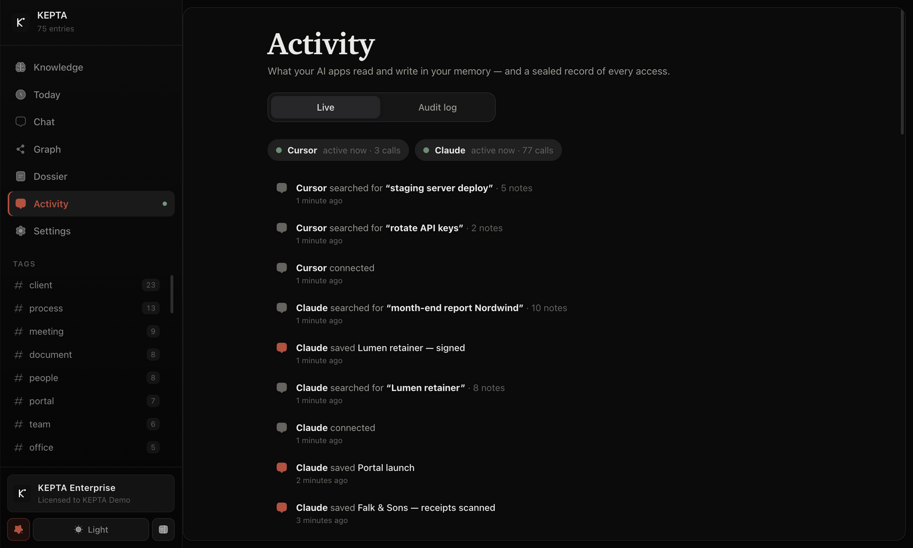

<p align="center"></p>
<p align="center">   <a href="https://www.linkedin.com/in/damian-todorovic-244235434"></a></p>

# KEPTA Core — deutsches Readme

Dein KI-Assistent vergisst alles. Jeder Chat beginnt bei null.

KEPTA ändert das — **lokal**. Eine verschlüsselte SQLite-Datei auf deinem Rechner, die **jede** KI liest und schreibt: Claude Desktop, Cursor, Gemini CLI, Cline, jeder MCP-Client — und Skripte über eine kleine **HTTP-API**. Keine Cloud, kein Konto, keine Telemetrie. Eine Datei, die dir gehört.

> **Dies ist der offene Kern** (AGPL-3.0): Memory-Engine, MCP-Server, HTTP-API — dazu der Python-Client unter MIT, damit ihn jedes Python-Projekt einbauen kann. Die vollständige Desktop-Anwendung ist **KEPTA Pro** — siehe unten. English: [README.md](README.md).

## ⚡ Erst sehen, dann verbinden

**Zuerst die Desktop-App:** [KEPTA Core herunterladen](https://github.com/DamianTodorovic/kepta-pro-releases/releases/latest) — jeder Download startet mit **einem Gratis-Pro-Tag** (24 Stunden, alle Werkzeuge, ohne Limiten, ohne Karte, ohne Konto, ohne Schlüssel), danach läuft sie gratis mit Tageslimiten und sperrt nie.

Oder kopflos, direkt in deinen Agenten:

```bash
npx -y kepta-mcp setup   # verbindet Claude Desktop, Claude Code, Cursor, Windsurf, VS Code, Gemini CLI, Cline und Roo Code
npx -y kepta import chatgpt <export-ordner>   # bring deine ChatGPT-Historie mit (Export → entpacken → import)
npx -y kepta-mcp stats        # das Terminal-Erlebnis: remember, recall, timeline, contradict
```

Dann sag deiner KI etwas, das sie behalten soll — und sieh zu, wie es ankommt. Mehr im [Schnellstart](#-schnellstart).

## 🚀 KEPTA — eine Engine, drei Stufen

**KEPTA ist eine Produktfamilie um eine Engine.** Die Engine in diesem Repository ist, womit deine Agenten sprechen — gratis und Open Source, für immer. Die Desktop-App ist **KEPTA Core**: der Gratis-Download, worin _du_ arbeitest. **KEPTA Pro** ist der Lizenzschlüssel, der ihre Tageslimiten entfernt. Teams und Organisationen bekommen dieselbe App mit mehr Kontrolle darüber.

| Stufe | Für | Preis | Was drin ist |
|---|---|---|---|
| **Core** | Alle — herunterladen und loslegen | **0 €**, für immer | Die kostenlose Desktop-App (macOS & Windows): Wissensgraph, Chat mit deinem Gedächtnis, Dossiers, Today, Privacy-Shield — **ein Gratis-Pro-Tag mit jedem Download**, danach Tageslimiten; sie sperrt nie. Dieses Repository ist die Engine darin, kopflos für Agenten: Verschlüsselung, Hybrid-Suche, MCP, HTTP-API, Python-Client, CLI, ChatGPT-Import |
| **Pro** | Einzelpersonen & Power User | **12 €/Monat oder 120 €/Jahr**, ein offline geprüfter Schlüssel, gekauft in der App | Dieselbe App ohne die Tageslimiten: Chat, Clipper, Computer-Scan, Dossiers, Audit-Export — alles, unbegrenzt |
| **Enterprise** | Teams, Praxen & Organisationen | **Nach Absprache** | Alles aus Pro, plus Team-Gedächtnis (geteiltes Wissen, Workspaces, Rollen, Admin-Konsole), SSO, zentrale Richtlinien, MDM-/Air-gapped-Ausrollung, Security-Dokumentation und Support |

Am Core wird nichts kaputtgekürzt, um Pro zu verkaufen — die beste Memory-Engine, die wir bauen können, ist die freie. **Verkauft wird, wie du sie einsetzt.**

### KEPTA Pro — die ganze Desktop-App

Eine native App für macOS und Windows, die dieselbe verschlüsselte Wissensbasis in ein zweites Gehirn verwandelt, das du sehen, durchsuchen, ordnen und dem du vertrauen kannst — jedes Dokument, jede Entscheidung, jede Verbindung, auf deinem eigenen Rechner.

| Today — was seit deinem letzten Besuch passiert ist und was einen Blick braucht | Activity — welche KI-App was liest und schreibt, live |
|---|---|
|  |  |
| **Privatsphäre-Schild — was eine Cloud-KI zu sehen bekäme** | **Der Wissensgraph — jede Notiz ein Knoten, jeder Link eine Kante** |
|  |  |

<sub>KEPTA Pro 2.13 mit einem erfundenen Demo-Korpus — nichts auf diesen Bildern ist echt. Claude und Cursor haben über den MCP-Server aus diesem Repository damit gearbeitet. Die Oberfläche ist englisch.</sub>

**Alle Funktionen im Vergleich.** ✅ vorhanden · **API** / **MCP** im Kern für Agenten und Skripte, ohne eigene Oberfläche dafür · — nur in KEPTA Pro

| Funktion | KEPTA Core | KEPTA Pro |
|---|:---:|:---:|
| **Sicherheit & Privatsphäre** | | |
| Verschlüsselt auf der Platte — SQLCipher 4, AES-256 und HMAC-SHA512 über jede Seite, WAL eingeschlossen | ✅ | ✅ |
| Der Schlüssel entsteht und liegt automatisch im Schlüsselbund — nichts einzutippen, Agenten sehen ihn nie | ✅ | ✅ |
| Wiederherstellungsschlüssel mit einem Klick, bereit für den Passwort-Manager | ✅ | ✅ |
| Einstellungen — samt KI-Schlüssel — in der verschlüsselten Datei | ✅ | ✅ |
| Nur `127.0.0.1`, kein Konto, keine Telemetrie — nichts verlässt den Rechner, außer du wählst eine Cloud-KI | ✅ | ✅ |
| Rate-Limiting, Helmet und Eingabeprüfung auf jeder Route | ✅ | ✅ |
| Gehärtete Desktop-Hülle — kein Node im Fenster, Sandbox, Content Security Policy | — | ✅ |
| **Notizen** | | |
| Anlegen, bearbeiten, löschen — Papierkorb mit Wiederherstellen | ✅ | ✅ |
| Vier Wissensarten — Fakt, Ereignis, Anleitung, Dokument — nach lesbaren Regeln mit Begründung zugeordnet | ✅ | ✅ |
| Bestehende Notizen nachträglich nach Art sortieren, mit Vorschau | ✅ | ✅ |
| Tags, Konfidenz 0–1, automatisch erkannte Entitäten | ✅ | ✅ |
| Scopes — Nutzer, Agent, Sitzung — damit eine Erinnerung weiß, wem sie gehört | API · MCP | API · MCP |
| Gültigkeitsfenster — Abgelaufenes wird markiert, nie still versteckt | ✅ | ✅ |
| Ersetzungsketten — ein neuer Fakt verdrängt den alten, die Historie bleibt | ✅ | ✅ |
| Übernahme aus dem alten `memories.json` — wiederholbar, mit Sicherung | ✅ | ✅ |
| **Suche** | | |
| Hybride Suche — BM25-Volltext + Vektoren + Entitäten, per Reciprocal Rank Fusion vereint | ✅ | ✅ |
| Lokales Reranking — Begriffsabdeckung, Phrasen, Titel, Tags; ohne Netz | ✅ | ✅ |
| Relevanz zuerst — Treffer nach Rang, der beste oben | ✅ | ✅ |
| Zeitreise-Suche — was zu jedem Zeitpunkt bekannt war (`asOf`) | API · MCP | API · MCP |
| Dauerhafte Embeddings über Ollama, berechnet von einer Hintergrund-Warteschlange | ✅ | ✅ |
| Zeitliche Gewichtung — abgelaufen ×0,5, ersetzt ×0,4 | ✅ | ✅ |
| Stoppwörter auf Deutsch und Englisch | ✅ | ✅ |
| Schalter für semantische Suche und ein Trefferregler von 5 bis alle | — | ✅ |
| Ein Codepfad für Oberfläche, HTTP-API und MCP — Agenten bekommen dieselbe Qualität wie du | ✅ | ✅ |
| Such-Eval — `npm run eval` misst Hit@1, Precision@5 und MRR | ✅ | ✅ |
| **Aufnehmen & importieren** | | |
| Dateien per Drag & Drop — PDF mit den Zeichentabellen eingebetteter Schriften, Markdown, Text, JSON — in Teilen | — | ✅ |
| Inbox-Ordner, beobachtet und automatisch übernommen | API | ✅ |
| Obsidian-Vault-Import — Frontmatter bleibt, `[[Wiki-Links]]` werden Graph-Kanten | API | ✅ |
| JSON-Import ganzer Notizsammlungen | API | ✅ |
| Alte Importe neu einlesen — erst zählen, erst nach deiner Bestätigung schreiben | API | ✅ |
| URL-Clipper — gegen SSRF geschützt, entfernt Navigationszeilen und Cookie-Banner | — | ✅ |
| Diesen Rechner durchsuchen — freiwillig, mit Vorschau; Schlüssel, Zugangsdaten, Browserprofile und Wallets bleiben gesperrt | — | ✅ |
| Auto-Lernen — den Kern einer Chat-Antwort speichern (standardmäßig aus) | — | ✅ |
| Markdown-Export in einen Ordner | API | ✅ |
| Device Sync — einen Scope zwischen den eigenen Geräten verschieben, als AES-256-GCM-Bundle mit Hash-Ketten-Protokoll | API | ✅ |
| **Wissensgraph** | | |
| Entitäten und Beziehungen aus `[[Wiki-Links]]` und automatischer Erkennung | API · MCP | ✅ |
| Nur-lesen-Wissensgraph — Notizen als Knoten, [[Links]] als Kanten (durchgezogen), ähnliche Notizen verbunden (gestrichelt), ziehen und klicken | ✅ | — |
| Terminal-Erlebnis — `remember`, `recall`, `timeline`, `contradict`, `stats` auf der verschlüsselten Datenbank | ✅ | ✅ (Desktop-App) |
| Interaktiver Graph mit zwei Ansichten — Kräfte-Layout und Baum (Dendrogramm); die Knoten gleiten hinüber | — | ✅ |
| Unbegrenzte Fläche — 3 000 Knoten und 9 500 Kanten bei 60 fps; zoomen, verschieben, ziehen, alles einpassen | — | ✅ |
| Zeitregler — der Graph, wie er an jedem Tag aussah | — | ✅ |
| Farbe nach Art, Größe nach Verbindungen, echte Links von bloßer Ähnlichkeit unterschieden; Doppelklick öffnet die Notiz | — | ✅ |
| **Pflege** | | |
| Duplikate erkennen — Embedding-Ähnlichkeit ≥ 0,92, lexikalischer Ersatz ohne Ollama | MCP | ✅ |
| Konsolidierung ersetzt statt zu löschen — nichts geht verloren | MCP | ✅ |
| Duplikat-Prüfung — Gruppen nebeneinander, die reichste Fassung mit einem Klick behalten, ein Rückgängig für alles | — | ✅ |
| Episodische Erinnerungen wachsen aus dem Chatverlauf | — | ✅ |
| Aktivitäts-Feed | ✅ live, mit dem Namen der KI-App | ✅ |
| **Agenten (MCP)** | | |
| MCP 2026-07-28, kompatibel mit 2025-06-18 und 2024-11-05 — stdio und Streamable HTTP | ✅ | ✅ |
| Acht Werkzeuge — suchen, speichern, ändern, löschen, auflisten, Graph, konsolidieren, vergessen — mit `outputSchema` und `structuredContent` | ✅ | ✅ |
| Schreib-Schleuse (optional) — ein lokales LLM entscheidet ADD, UPDATE, DELETE oder NOOP, bevor Neues gespeichert wird | ✅ | ✅ |
| npm-Paket `kepta-mcp`, eingetragen in der offiziellen MCP-Registry | ✅ | ✅ |
| Claude Desktop, Claude Code, Cursor, Windsurf und VS Code in einem Schritt verbinden — `npx kepta-mcp setup` oder ein Klick | ✅ | MCP-Block zum Kopieren |
| Python-Client — `pip install kepta`, nur Standardbibliothek | ✅ | ✅ |
| **Chat-Cockpit** | | |
| 20 Anbieter-Vorlagen — Ollama, LM Studio, OpenAI, Anthropic, Gemini, Mistral, Groq, DeepSeek, xAI und mehr | — | ✅ |
| Modelle von Ollama und LM Studio mit einem Klick finden | — | ✅ |
| Streaming mit Stopp-Knopf, Markdown-Darstellung | — | ✅ |
| Quellenangaben — jede Antwort zeigt, welche Erinnerungen sie genutzt hat | — | ✅ |
| Datumsbewusste Prompts und ein sichtbares Token-Budget | — | ✅ |
| **Oberfläche** | | |
| Eine Oberfläche für dein Gedächtnis — nach Art und Tag stöbern, suchen, lesen, schreiben, Papierkorb | ✅ im Browser | ✅ eigene App |
| Native Desktop-App für macOS, Windows und Linux | — | ✅ |
| Hell und dunkel | ✅ | ✅ |
| Mit der Tastatur — Kürzel; in Pro zusätzlich eine Befehlspalette (⌘K) | ✅ | ✅ |
| Tag-Filter mit Zählern | ✅ | ✅ |
| Wissensliste mit lesbaren Titeln und Vorschauen | ✅ | ✅ |
| Quellen-Chips, Teil-Angaben, *Open file*, Gruppierung nach Datei, Art oder Zeitraum | — | ✅ |
| Fokus-Modus und Textgröße (100 / 115 / 130 %) | — | ✅ |
| Einrichtungsassistent mit Startpaket | — | ✅ |
| Systemstatus — erkennt lokale KI, prüft den Speicher, zeigt Diagnosen | — | ✅ |
| **Preis** | | |
| Lizenz | kostenlos · AGPL-3.0 | ein offline geprüfter Lizenzschlüssel |

**Ein Lizenzschlüssel, offline auf deinem Rechner geprüft — kein Konto, kein Internet.** KEPTA ruft nirgends an. Pro kostet 12 €/Monat oder 120 €/Jahr und wird direkt in der App gekauft — der Upgrade-Knopf zeigt immer auf den aktuell lebenden Weg (solange der Selbstbedienungs-Checkout in der Schlussprüfung ist, ist das die direkte Linie zu **[mir auf LinkedIn](https://www.linkedin.com/in/damian-todorovic-244235434)**); Enterprise — Team-Gedächtnis, SSO, MDM, Security-Dokumentation — wird persönlich zugeschnitten. Die Installer liegen unter **[kepta-pro-releases](https://github.com/DamianTodorovic/kepta-pro-releases/releases/latest)**.

## ⚡ Schnellstart

**1. Mit deinen KI-Apps verbinden:** `npx -y kepta-mcp setup` findet Claude Desktop, Claude Code, Cursor, Windsurf und VS Code und trägt KEPTA dort ein — es fragt je App (`--yes` verbindet alle), sichert jede Datei, die es ändert, und lässt alle anderen Einträge stehen. Jeder andere MCP-Client:

```json
{
  "mcpServers": {
    "kepta": {
      "command": "npx",
      "args": ["-y", "kepta-mcp"]
    }
  }
}
```

**2. Deine KI verbinden:** `
**3. HTTP-API:**

```bash
npm install && npm run dev
# → http://127.0.0.1:3000
```

**4. Docker** (nur MCP-Server): `docker build -t kepta-mcp .`

**Zahlen:** **437 Tests** · 29 Routen · `npm run eval` — Eval auf 58 Notizen / 45 Anfragen (Hit@1, Precision@5, MRR).

## 🔐 Verschlüsselt auf der Platte

SQLCipher 4 (AES-256, HMAC-SHA512 je Seite, WAL eingeschlossen). Der Schlüssel liegt im Schlüsselbund des Betriebssystems, nie im Klartext auf der Platte. Details und wie du eine Kopie des Schlüssels aufbewahrst: [SECURITY.md](SECURITY.md).

## 🧪 Von der CI erzwungene Schwellen

| Bereich | Schwellen |
|---|---|
| alles zusammen | **70 %** der Zeilen · **72 %** der Funktionen · 56 % Branches · 66 % Statements |
| `src/core` | **87 %** der Zeilen · **89 %** der Funktionen · 74 % Branches · 85 % Statements |

## 👋 Wer KEPTA baut

KEPTA baut **Damian Todorovic**. Fragen, Ideen, eine Lizenz für dein Team — oder du willst einfach mitverfolgen, wohin das geht: **[finde mich auf LinkedIn](https://www.linkedin.com/in/damian-todorovic-244235434)**.

## 📄 Lizenz

[AGPL-3.0-or-later](LICENSE). **KEPTA Core** ist die kostenlose Desktop-App auf dieser Engine — Wissensgraph, Chat, Rechner-Scan, Privacy-Shield, Audit-Log und das polierte Erlebnis: jeder Download startet mit einem Gratis-Pro-Tag, danach läuft sie mit Tageslimiten und sperrt nie; die Limiten sind versiegelt gegen Neustarts, Uhr-Tricks und sogar das Löschen von Datenbank und Schlüsselbund (App 2.13.7). **KEPTA Pro** ist der Lizenzschlüssel, der die Limiten entfernt (12 €/Monat, 120 €/Jahr, gekauft in der App). **KEPTA Enterprise** wird nach Absprache lizenziert: alles aus Pro, plus Team-Gedächtnis für Praxen und Kanzleien, SSO, MDM und Security-Dokumentation — passend zu deiner Organisation. Das npm-Paket `kepta-mcp` trägt dieselbe AGPL wie dieses Repository; der Python-Client unter `python/` ist MIT. Lizenzen und Fragen — [schreib mir auf LinkedIn](https://www.linkedin.com/in/damian-todorovic-244235434).
