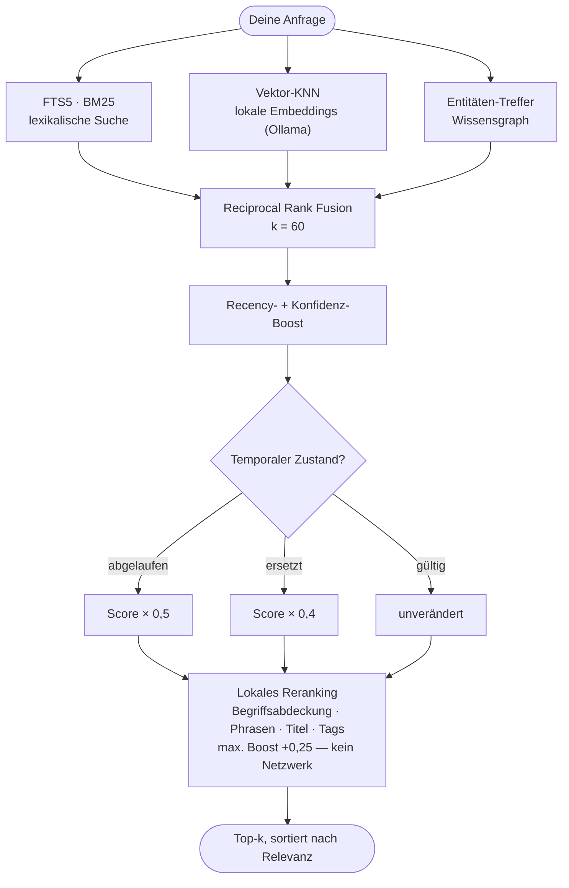

<p align="center"></p>
<p align="center">   <a href="https://www.linkedin.com/in/damian-todorovic-244235434"></a></p>

# KEPTA — das Gedächtnis für KI-Systeme (deutsches Readme)

Deine KI vergisst alles. Jeder Chat beginnt bei null.

KEPTA ändert das — **lokal**. Eine verschlüsselte SQLite-Datei auf deinem Rechner, die **jede** KI liest und schreibt: Claude Desktop, Cursor, Gemini CLI, Cline, jeder MCP-Client — und Skripte über eine kleine **HTTP-API**. Keine Cloud, kein Konto, keine Telemetrie. Eine Datei, die dir gehört.

> **Dies ist der source-available Kern** (BUSL-1.1 — jede Zeile öffentlich, aber kein OSI-zertifiziertes Open Source; Übergang in AGPL-3.0-or-later vier Jahre nach jedem Release): Memory-Engine, MCP-Server, HTTP-API — dazu der Python-Client unter MIT, damit ihn jedes Python-Projekt einbauen kann. **Alles, was das Gedächtnis klüger macht, liegt in dieser Engine — gratis, unbegrenzt, und innerhalb des Gedächtnisses gibt es keine Stufen, nichts wird zurückgehalten, um etwas zu verkaufen.** English: [README.md](README.md).

Fragen, Security-Feedback oder Benchmark-Kritik? → **[Discussions](https://github.com/DamianTodorovic/kepta/discussions)**

## ⚡ Ein Befehl, jeder KI-Client

```bash
npx -y kepta-mcp setup   # verbindet Claude Desktop, Claude Code, Cursor, Windsurf, VS Code, Gemini CLI, Cline und Roo Code
npx -y kepta-mcp import chatgpt <export-ordner>   # bring deine ChatGPT-Historie mit (Export → entpacken → import)
npx -y kepta-mcp stats        # das Terminal-Erlebnis: remember, recall, timeline, contradict
```

Dann sag deiner KI etwas, das sie behalten soll — und sieh zu, wie es ankommt. Mehr im [Schnellstart](#-schnellstart).

## 🖥️ Oder lad die Desktop-App

KEPTA gibt es als echte Desktop-App — dieselbe Engine mit ganzer Oberfläche: Memory-Browser, Hybridsuche mit Spuren-Herkunft, Wissensgraph, Zeitreise, Dossiers und ein Chat, der das Gedächtnis liest. Die DMG für deinen Mac liegt im [neuesten Release](https://github.com/DamianTodorovic/kepta/releases/latest) (Apple Silicon oder Intel), reinziehen in „Programme", einmal Rechtsklick → **Öffnen** — macOS fragt ein einziges Mal nach (ad-hoc-signiert), dann nie wieder.

Die App ist gratis wie alles in diesem Repository. KEPTA Enterprise (Team- und Mandanten-Gedächtnis, Audit-Kette, Menschenschleuse, Point-in-Time-Recovery) wird nach Absprache lizenziert — [schreib mir auf LinkedIn](https://www.linkedin.com/in/damian-todorovic-244235434).

## 🧠 Eine Engine. Frei. Für jede KI.

KEPTA ist kein Feature in einer App — es ist eine Gedächtnis-Schicht, die jedes Modell, jede App und jedes Kontextfenster überlebt. Drei Türen führen in dieselbe verschlüsselte Datei:

| Tür | Wer sie nutzt |
|---|---|
| **MCP** — 8 Tools, stdio + Streamable HTTP | Jeder MCP-Client: Claude, Cursor, Gemini CLI, Cline, Codex, Zed, deine eigenen Agenten |
| **HTTP-API** — 31 Routen, nur Loopback | Skripte, Cron-Jobs, Agenten-Teams, Automatisierungen |
| **Python** — `pip install kepta`, nur Standardbibliothek | Jedes Python-Projekt, eingebettet |

**Frei heißt frei:** 0 €, für immer, ohne Limiten — kein Konto, keine Tageslimiten, kein Schlüssel, nichts gesperrt. Die beste Memory-Engine, die wir bauen können, ist die freie; genau das ist der Punkt.

**Teams und Organisationen** — Team-Gedächtnis, zentrale Richtlinien, MDM, organisationsweites Audit — bekommen **KEPTA Enterprise auf Anfrage**. Koordination ist das Einzige, was wir je berechnen; Speicherqualität nie. → [schreib mir auf LinkedIn](https://www.linkedin.com/in/damian-todorovic-244235434)

## ⚡ Schnellstart

**1. Mit deinen KI-Apps verbinden:** `npx -y kepta-mcp setup` findet Claude Desktop, Claude Code, Cursor, Windsurf, VS Code, Gemini CLI, Cline und Roo Code und trägt KEPTA dort ein — es fragt je App (`--yes` verbindet alle), sichert jede Datei, die es ändert, und lässt alle anderen Einträge stehen. Jeder andere MCP-Client:

```json
{
  "mcpServers": {
    "kepta": {
      "command": "npx",
      "args": ["-y", "kepta-mcp"]
    }
  }
}
```

**2. Deine KI verbinden:** `
**3. HTTP-API:**

```bash
npm install && npm run dev
# → http://127.0.0.1:3000
```

**4. Docker** (nur MCP-Server): `docker build -t kepta-mcp .`

**Zahlen:** **474 Tests** · 31 Routen · `npm run eval` — Eval auf 58 Notizen / 45 Anfragen (Hit@1, Precision@5, MRR).

## 🔍 Wie eine Anfrage ihre Antwort findet


```mermaid
flowchart TD
  Q(["Deine Anfrage"]) --> A["FTS5 · BM25<br/>lexikalische Suche"]
  Q --> B["Vektor-KNN<br/>lokale Embeddings (Ollama)"]
  Q --> C["Entitäten-Treffer<br/>Wissensgraph"]
  A --> R["Reciprocal Rank Fusion<br/>k = 60"]
  B --> R
  C --> R
  R --> BO["Recency- + Konfidenz-Boost"]
  BO --> T{"Temporaler Zustand?"}
  T -->|abgelaufen| X5["Score × 0,5"]
  T -->|ersetzt| X4["Score × 0,4"]
  T -->|gültig| K1["unverändert"]
  X5 & X4 & K1 --> R2["Lokales Reranking<br/>Begriffsabdeckung · Phrasen · Titel · Tags<br/>max. Boost +0,25 — kein Netzwerk"]
  R2 --> OUT(["Top-k, sortiert nach Relevanz"])
```

## 🔐 Verschlüsselt auf der Platte

SQLCipher 4 (AES-256, HMAC-SHA512 je Seite, WAL eingeschlossen). Der Schlüssel liegt im Schlüsselbund des Betriebssystems, nie im Klartext auf der Platte. Details und wie du eine Kopie des Schlüssels aufbewahrst: [SECURITY.md](SECURITY.md).

## 🧪 Von der CI erzwungene Schwellen

| Bereich | Schwellen |
|---|---|
| alles zusammen im Coverage-Scope | **70 %** der Zeilen · **72 %** der Funktionen · **56 %** Branches · **66 %** Statements |
| `src/core` | **87 %** der Zeilen · **89 %** der Funktionen · **74 %** Branches · **85 %** Statements |

Gemessen wird `src/core/**` plus `server.ts` (`vitest.config.ts`) — der headless Kern,
also das Produkt. `tools/`, `scripts/`, `npm/` und `python/` haben eigene Suiten, aber
keine Schwelle; sie stecken nicht in diesen Prozentzahlen.

### Latenz — gemessen, öffentlich

Median-Suchzeiten auf einem Laptop (Apple M4), jeder Lauf committed in [`tools/latenz/ergebnisse/`](tools/latenz/ergebnisse/): **46,6 ms** Median bei 100.000 Erinnerungen (p95 87,6 ms), **276,5 ms** Median bei **1.000.000 Erinnerungen**. Beide Läufe messen die Engine mit ausgeschalteter Verschlüsselung und einem deterministischen Stub-Embedder — die Records sagen das selbst, in `konfiguration.verschluesselung` und `konfiguration.embedder`. Die Datei auf der Platte ist durchgehend SQLCipher-4-verschlüsselt; nur die Krypto-Kosten stecken in diesen beiden Medianen nicht.

### Benchmark-Protokoll — LongMemEval-S, vollständig öffentlich

KEPTA liefert seinen Gedächtnis-Benchmark als Rohdaten je Frage statt als Zahl: **jeder Lauf committed alle 500 Fragen in diesem Repository**, in [`tools/longmemeval/ergebnisse/`](tools/longmemeval/ergebnisse/) — je mit id, Typ und Fähigkeit, dem Judge-Urteil, der Zahl der geprüften Notizen, dem Kontext, der das Urteil gemacht hat, und dem Wörtlich-Treffer der Referenzantwort. Frage- und Antwort-*Text* liegen nicht im Repo: der kommt aus dem festgeschriebenen Upstream-Datensatz, dessen SHA-256 jeder Record trägt. Fixierter Datensatz (LongMemEval-S, 500 Fragen, SHA-gepinnt), fixierter Judge, lokal vollständig reproduzierbar — siehe [`tools/longmemeval/README.md`](tools/longmemeval/README.md).

Die veröffentlichte Zahl ist **61,5 %** auf LongMemEval-S — bewertet von einem **lokalen 14B-Judge** (`qwen2.5:14b`, Q4, läuft auf einer Consumer-GPU), null Cloud. Die 3B-Judge-Serie ist vollständig als Vergleichsbasis committed: 29,2 → 32,5 → 33,2 → 37,0 → 39,0 — jeder Schritt ist ein Lauf-Record im selben Ordner, kein neues Modell, keine Cloud, kein Fine-Tuning. Dieselbe Retrieval-Pipeline, fairere Bewertung: Ein stärkerer lokaler Judge misst, was der 3B-Judge bei langen Kontexten unterschätzt hat. Die 14B-Judge-Kette auf derselben Pipeline: 54,6 → 55,0 (HyDE-lite) → **61,5** (topk 32 + Zeitsplit + HyDE).

**Was diese Zahl misst — das ist der Vergleichspunkt, bevor jemand sie gegen eine andere rechnet.** Es ist **Kontext-Suffizienz**, keine End-to-End-Antwortgenauigkeit: Ein lokaler Judge (qwen2.5:14b, Temperatur 0, Prompt v1) bewertet, ob die *geretrieften Kontexte* die Referenzantwort enthalten. Es arbeitet kein Generator-LLM mit, ein `TEILWEISE`-Urteil zählt als halber Punkt, und 29,8 % der Fragen dieses Laufs entschied ein deterministischer Wörtlich-Treffer — ohne jeden Judge-Aufruf. Zeps veröffentlichte 63,8 % sind Antwortgenauigkeit einer vollen Generierungspipeline, gerichtet von einem Cloud-Judge: verwandte Evidenz, **nicht dieselbe Metrik**. Und die Einschränkung, offen ausgesprochen: Jeder Hebel der Serie (topk, `--temporal`, `--zeitsplit`, HyDE, Judge-Größe) wurde auf denselben 500 Fragen gewählt, die 61,5 % sind also ein In-Sample-Wert nach oben verzerrt; ein unberührter Holdout-Split steht aus. Genau deshalb liegen die Rohdaten je Frage im Repo — prüft uns, auch an dieser Einordnung.

## 👋 Wer KEPTA baut

KEPTA bauen **Damian Todorovic** und **Emil Wagner** — ein kleines Team aus Deutschland, das öffentlich baut. Fragen, Ideen, Enterprise für dein Team — oder du willst einfach mitverfolgen, wohin das geht: **[finde uns auf LinkedIn](https://www.linkedin.com/in/damian-todorovic-244235434)**.

## 📄 Lizenz

[BUSL 1.1](LICENSE) — source-available, kein OSI-zertifiziertes Open Source: jede Zeile öffentlich, Produktivnutzung in der eigenen Organisation immer erlaubt, Anbieten als gehosteter Service ist vorbehalten, und jede Version geht vier Jahre nach Release in AGPL-3.0-or-later über. **Das npm-Paket `kepta-mcp` trägt dieselbe Lizenz wie dieses Repository; der Python-Client unter `python/` bleibt MIT**, damit ihn jedes Python-Projekt einbauen kann. KEPTA Enterprise für Teams und Organisationen wird nach Absprache lizenziert — [schreib mir auf LinkedIn](https://www.linkedin.com/in/damian-todorovic-244235434).
