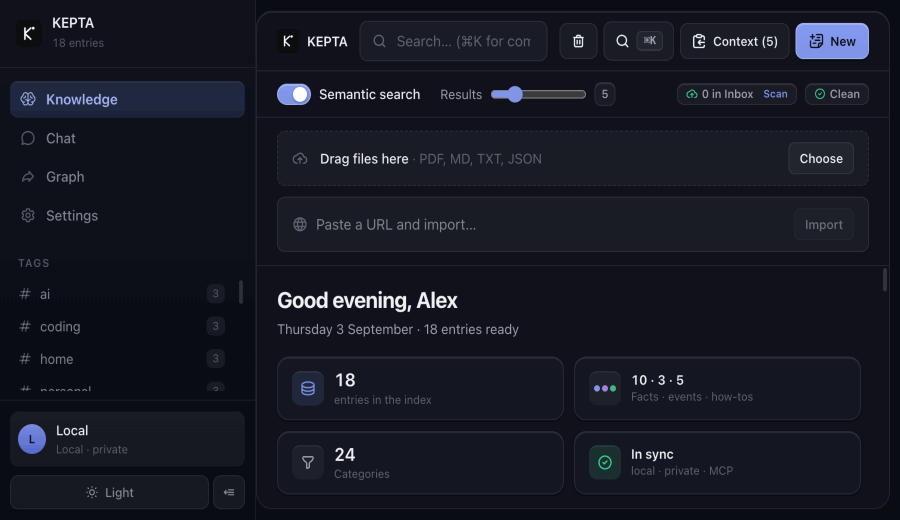
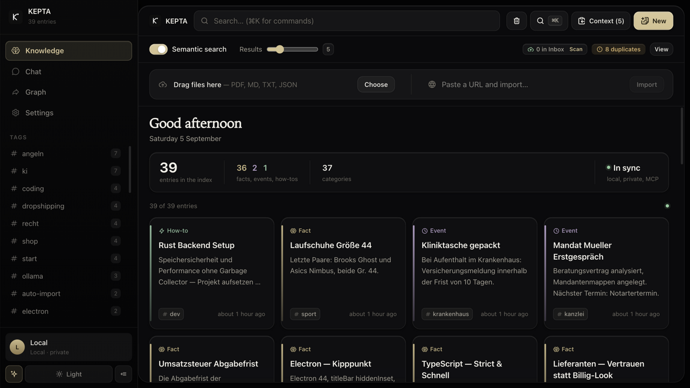
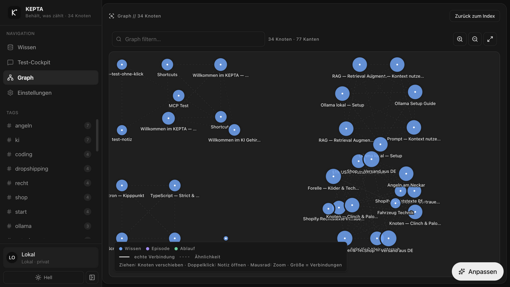
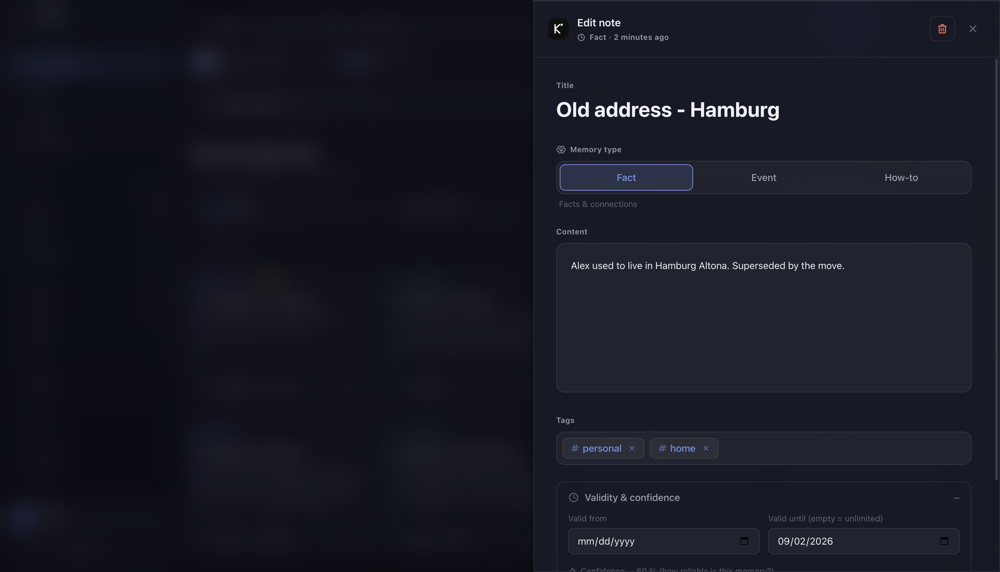
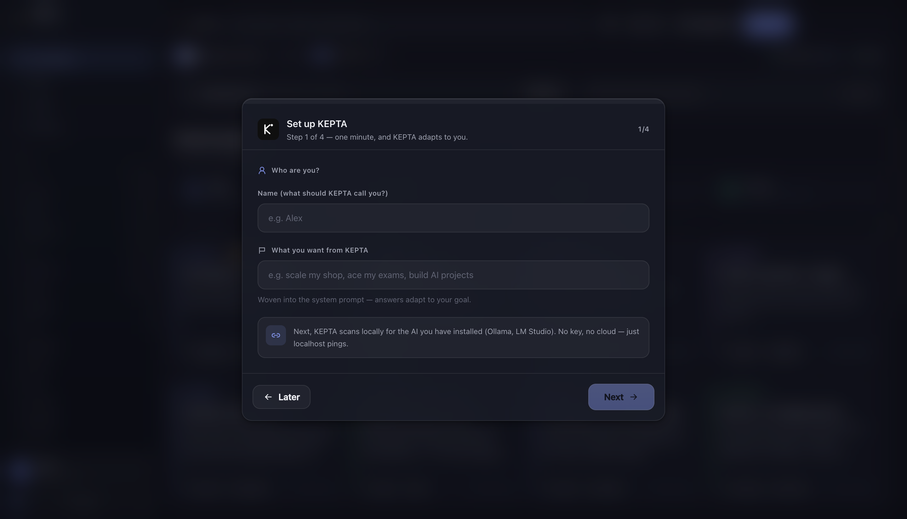
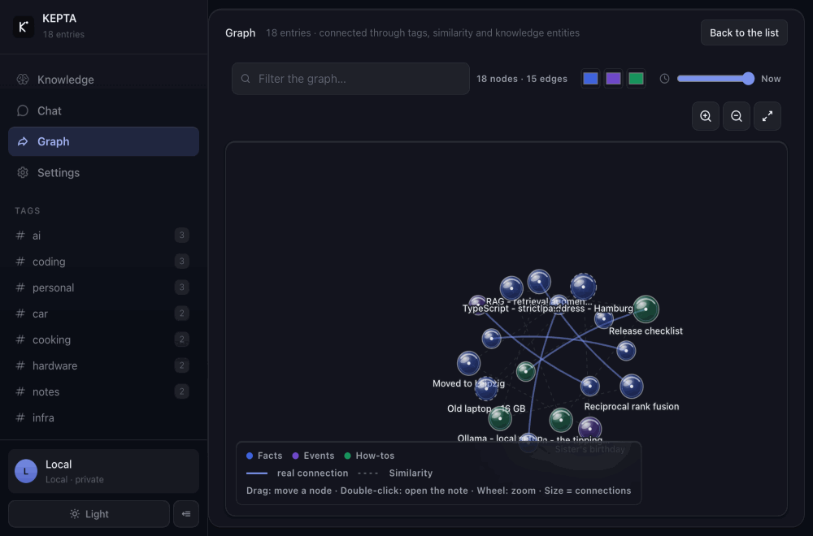
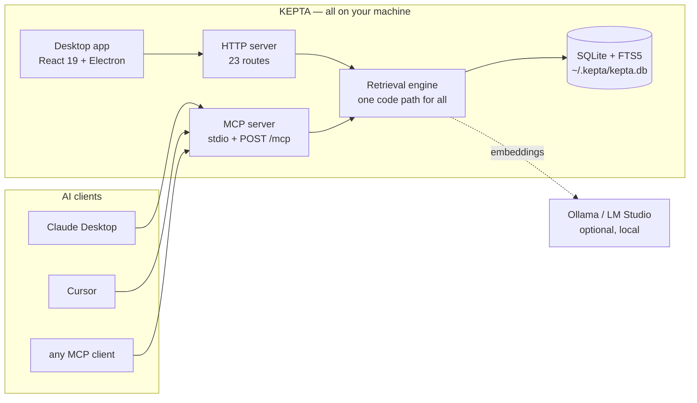
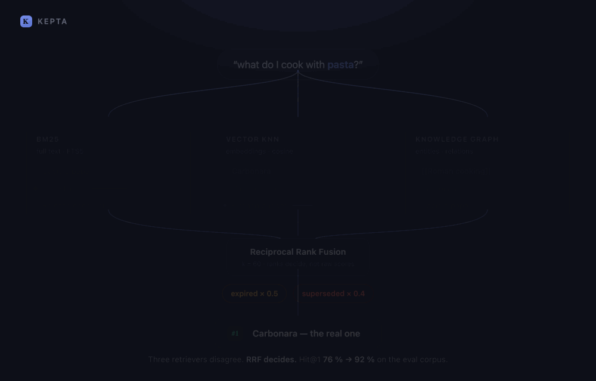
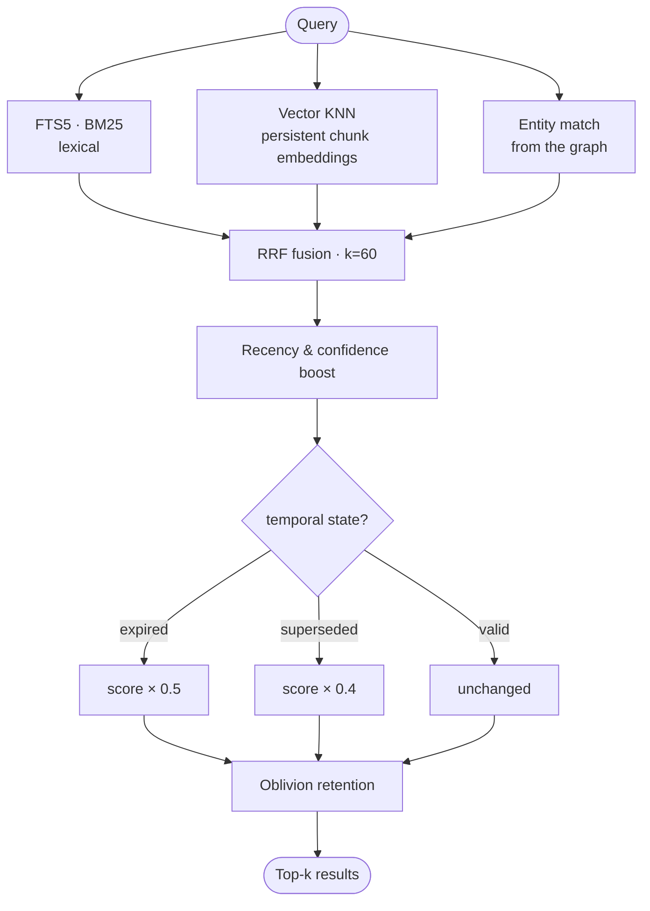

<p align="center"></p>
<h1 align="center">KEPTA — Keeps what matters</h1>
<p align="center"><strong>Your AI assistant forgets you after every chat.<br>KEPTA remembers — on your own computer, in one file.</strong></p>

<p align="center"><sub>Open source · no cloud · no account · no subscription<br>SQLite · hybrid retrieval · knowledge graph · MCP</sub></p>

<p align="center"><strong>English</strong> · <a href="README.de.md">🇩🇪 Deutsch</a></p>

<p align="center"><a href="https://github.com/DamianTodorovic/kepta/releases"></a> <a href="https://github.com/DamianTodorovic/kepta/actions/workflows/build.yml"></a> <a href="https://www.npmjs.com/package/kepta-mcp"></a> <a href="https://pypi.org/project/kepta/"></a>   <a href="LICENSE"></a> </p>

## 🎬 The whole app in one pass

<p align="center"></p>

<sub>A full pass through the app: search, the editor with type and validity, creating a note, the trash with restore, the knowledge graph and its time slider, the chat cockpit, the MCP endpoints, the command palette and the theme switch. Recorded from version 2.6.3 on invented demo data.</sub>

| Index & hybrid search | Knowledge graph |
|---|---|
|  |  |
| **Editor — type, validity, confidence** | **Setup — topics & starter pack** |
|  |  |

<sub>Recorded from version 2.6.0 on a demo corpus. No real data — every entry was made up for these shots.</sub>

### Knowledge that has a date

<p align="center"></p>

<sub>The time slider answers a question most note apps cannot: <em>what did I know in November?</em> Every memory carries a validity window, so the graph can be replayed. The dimmed nodes are not deleted — they simply were not true yet.</sub>

## 🙋 New here? Start with this

**The problem.** You use ChatGPT, Claude or something similar. You explain your project, your client, the way you like things done. The next day you open a fresh chat and it knows none of it. So you explain it again. And again.

**What KEPTA is.** A small program that runs on your own computer and remembers those things for you. Your assistant can look them up and write new ones back by itself. Nothing is sent anywhere — the notes live in a single file on your machine, like a document.

**What that looks like on an ordinary day.** You tell Claude to remember that your client bills quarterly. Two weeks later, in a brand-new chat, you ask about the invoice and it already knows. You drop a PDF into a folder and your assistant can quote from it. You move house, and the old address stops coming back.

**Is it for you?**

- You use an AI assistant often and keep repeating yourself → yes.
- You want what you tell it to stay on your own machine → yes.
- You are looking for a notes app to read and write by hand → probably not. KEPTA is built so your *assistant* uses it.

### Do I need to be a developer?

**To use the app — no.** Download the file for your system, open it, done. It is an ordinary window: a list, a search box, a settings page. The section [Which file do I need?](#-which-file-do-i-need) tells you exactly which one to take.

**To connect it to Claude Desktop or Cursor — a little.** You paste one short block of text into one configuration file. The block is ready to copy under *Settings → MCP / API*. If you have never edited such a file, this is the single step worth setting aside ten minutes for.

**For the smarter search — optional.** KEPTA searches perfectly well out of the box. Install [Ollama](https://ollama.com) — one free download — and it will additionally find notes that mean the same thing in different words.

<details>
<summary><strong>The words used on this page, in plain terms</strong></summary>

| Word | What it means here |
|---|---|
| **Agent** | An AI program that can use tools instead of only answering — Claude Desktop or Cursor, for instance. |
| **MCP** | An agreed language for such programs to talk to tools. KEPTA speaks it, so those assistants can read and write your notes. |
| **SQLite** | A database that is simply one file on your disk. Nothing to run, nothing to log into; you can copy it like a photo. |
| **Embedding / vector** | Text turned into numbers, so a computer can tell that "car workshop" and "garage" mean nearly the same thing. |
| **BM25 / full text** | Classic keyword search: it finds the words you actually typed. |
| **Knowledge graph** | Your notes linked to one another, like `[[links]]` in a wiki. |
| **RRF** | The formula that merges the three searches above into one ranking. |
| **Local-first** | Everything happens on your machine. No upload, no account, no subscription. |
| **Open source / MIT** | The whole source code is public and free to use. You can read what it does instead of taking my word for it. |

</details>

## 🎯 What it's for

1. **One brain for every AI tool** — Claude Desktop, Cursor and anything else that speaks MCP share the same knowledge base. What one agent learns, the next one already knows.
2. **Keep agents sharp instead of letting them rot** — every memory carries a type, a validity window and a confidence score. Contradictions supersede each other; expired facts are flagged, not silently served.
3. **A second brain** — notes, projects and knowledge found by meaning. Ask *"what do I cook with pasta"* and the carbonara recipe comes back, once `ollama pull nomic-embed-text` has run. Without an embedding model, search stays lexical and still works.
   **Measured caveat, September 2026:** that example works in English and does not work in German. On a four-note check (`npm run embed:sprachtest`) the default model answers 4 of 4 English paraphrase questions and 1 of 4 of the same questions translated into German. The implementation is not at fault — normalised cosine, 768 dimensions — the default model is English-centric. If your notes are German, expect lexical search to carry most of the weight until you switch to a multilingual model such as `bge-m3`.
4. **Capture without friction** — drag in files (PDF/MD/TXT), clip URLs, watch an inbox folder, save chat answers.
5. **Obsidian bridge** — vault import and export (Markdown + frontmatter); `[[wiki links]]` become graph edges.
6. **Private** — everything lives in `~/.kepta/`. MIT licensed, no account.
7. **Research** — a knowledge graph with real edges, duplicate detection, and a trash can with undo.
8. **Two-minute dev setup** — copy the MCP config, `POST /mcp` (protocol 2026-07-28, 8 tools), HTTP API, `npm run eval` (Hit@1 62 %) and `npm run ablation` (what each retrieval leg contributes).

## 🏗️ How it fits together



No service in between, no account, no telemetry. The server binds to `127.0.0.1` unless you set `KEPTA_HOST` yourself. Your memories are stored only in that SQLite file — there is no server of mine for them to reach. The one path where data does leave is the app's optional chat: if you enter a key for OpenAI, Anthropic or another provider, what you send that provider goes to them. It is off until you add a key, and the memory store is never synced anywhere.

## 🔍 How search decides

<p align="center"></p>

<sub>Real output from an 18-note corpus, not a mock-up. For the query <em>Roman cooking</em> the vector track ranked Cacio e pepe first while full text and the graph ranked Carbonara first; RRF settled it by 0.0004. Note that RRF works on ranks, so one track cannot win simply by producing bigger numbers. The precise version:</sub>




Without Ollama the vector track drops out and everything continues lexically. Search degrades; it does not break.

## 🧩 Every feature

<details open>
<summary><strong>Capture &amp; store</strong></summary>

- Create, edit and delete notes — **trash instead of hard delete**, with restore
- **Memory types**: `semantic` (facts), `episodic` (events), `procedural` (how-to)
- **Scope**: `user`, `agent`, `session` — separates who a memory belongs to
- **Confidence** 0–1, free-form tags, automatically extracted entities
- **Temporal validity**: `valid_from` / `valid_to`. Expired entries are marked, never quietly hidden
- **Supersede chains** (`superseded_by`): contradictions displace each other and the history survives
- **Files** by drag and drop: PDF, MD, TXT, JSON — chunked at 2000 characters
- **URL clipper** with SSRF protection (IP literals in every notation, DNS resolution, every redirect hop checked)
- **Auto-learn** (**off** by default): on request, KEPTA saves the key point of each chat answer as a node (tag `auto-learn`). The first time an answer would have been learnable, it says so once — with a button to switch it on. Optional small extraction model, 45-second limit, and both success **and** failure are reported
- **Inbox folder** watched and ingested automatically
- **Obsidian vault import**: Markdown + YAML frontmatter, `[[wiki links]]` become graph edges
- **Markdown export** to `~/.kepta/export/`
- **Migration** from the previous version (`memories.json`) — idempotent, with a backup

</details>

<details open>
<summary><strong>Search &amp; retrieval</strong></summary>

- **Hybrid retrieval**: FTS5 BM25 + vector KNN + entity match, fused with Reciprocal Rank Fusion
- **Stopwords removed from the query** in both German and English, so a note does not gain rank merely by containing *with* or *die*
- **Persistent embeddings** via Ollama (`nomic-embed-text`), computed by a background queue instead of re-embedding on every query
- **Temporal weighting**: expired ×0.5, superseded ×0.4
- **Semantic search** can be switched off, **top-k** is a slider
- **One code path** for the UI, the HTTP API and MCP — agents get exactly the quality you get
- **Eval harness**: `npm run eval` measures Hit@1 and Precision@5 against a fixed corpus

</details>

<details open>
<summary><strong>Knowledge graph</strong></summary>

- Entities and relations from `[[wiki links]]` and automatic extraction
- Force-directed layout, zoom, draggable nodes
- **Time slider** — shows what was known at a chosen point in time
- Colour by memory type, node size by number of connections
- Tells a real connection apart from mere similarity
- Double-click opens the note

</details>

<details open>
<summary><strong>Maintenance &amp; consolidation</strong></summary>

- **Duplicate detection** by embedding similarity (≥ 0.92), with a lexical fallback when Ollama is absent
- **Consolidation supersedes instead of deleting** — nothing is lost
- **Auto-tagging** of new entries
- **Episodic memories** grow out of chat history

</details>

<details open>
<summary><strong>Agent interface (MCP)</strong></summary>

Protocol `2026-07-28`, backwards compatible with `2025-06-18` and `2024-11-05`. Two transports: **stdio** and **Streamable HTTP** (`POST /mcp`). All eight tools ship an `outputSchema` and return `structuredContent`.

| Tool | Purpose |
|---|---|
| `memory_search` | Hybrid retrieval with temporal weighting |
| `memory_save` | Create, including type, scope and validity |
| `memory_update` | Change an existing memory |
| `memory_delete` | Move to trash |
| `memory_list` | Filter by type, scope, tags |
| `memory_graph` | Query entities and relations |
| `memory_consolidate` | Find and merge duplicates |
| `memory_forget` | Expire or supersede |

</details>

<details>
<summary><strong>Chat cockpit</strong> — a proving ground, not a feature magnet</summary>

- **20 provider presets**: Ollama, LM Studio, OpenAI, Anthropic, Gemini, Mistral, Groq, DeepSeek, xAI, Perplexity, Together, Fireworks, Cohere, Cerebras, HuggingFace, Novita, OpenRouter, GitHub Models, Azure, custom endpoint
- **Model discovery** for Ollama and LM Studio in one click, no key required
- **SSE streaming** with a stop button, Markdown rendering
- **Source citations**: every answer shows which memories it used
- **Date-aware prompting** — today's date and validity markers go into the context
- **Token budget** visible

The chat exists to prove retrieval works. Day-to-day use runs through MCP.

</details>

<details>
<summary><strong>Interface</strong></summary>

- **Command palette** (⌘K) for everything without the mouse
- **Tag filter** with counts and multi-select
- **Light/dark** and **focus mode**
- **Setup wizard** with a themed starter pack
- **System status**: detects local AI, checks storage, shows diagnostics
- **Activity feed** via `/api/activity`
- Duplicate banner with a jump link

</details>

<details>
<summary><strong>HTTP API — 23 routes</strong></summary>

| Area | Routes |
|---|---|
| Memories | `/api/memories`, `/api/memories/:id`, `/api/memories/:id/restore`, `/api/memories/search`, `/api/memories/import`, `/api/memory` |
| Search &amp; graph | `/api/search`, `/api/graph`, `/api/embed` |
| Import &amp; export | `/api/import/markdown`, `/api/export/markdown`, `/api/clip` |
| Inbox | `/api/inbox/status`, `/api/inbox/scan` |
| Chat | `/api/chat`, `/api/chat/stream`, `/api/models` |
| MCP | `POST /mcp`, `/api/mcp/tools`, `/api/mcp/search`, `/api/mcp/save`, `/api/tools` |
| System | `/api/health`, `/api/storage-info`, `/api/activity`, `/api/profile` |

</details>

<details>
<summary><strong>Privacy &amp; hardening</strong></summary>

- All data in `~/.kepta/` — one SQLite file that belongs to you
- The server binds to **`127.0.0.1` only** (deliberate override via `KEPTA_HOST`)
- **SSRF protection** in the URL clipper: normalised IP checks, DNS resolution, every redirect hop verified
- **Content Security Policy** in the Electron session, `nodeIntegration` off, sandbox on
- Rate limiting, Helmet, input validation on every route
- No account, no telemetry, no phone-home
- With no AI configured, not a single byte leaves the machine

</details>

## 📦 npm package — the MCP server on its own

```bash
npx -y kepta-mcp
```

That is the entire installation: one file, 20 kB, no dependencies. It gives an agent a memory **without the desktop app** — same `~/.kepta/kepta.db`, so you can start headless and add the window later, or run both side by side. Needs Node 22.13 or newer, because that is when `node:sqlite` arrived. Listed in the [official MCP registry](https://registry.modelcontextprotocol.io) as `io.github.DamianTodorovic/kepta`. Details: [npm/README.md](npm/README.md) · [npm](https://www.npmjs.com/package/kepta-mcp)

## 🐍 Python client

```bash
pip install kepta
```

```python
from kepta import KeptaClient

kepta = KeptaClient()          # finds the running instance on its own

kepta.save("Carbonara", "Guanciale, pecorino, egg yolk. No cream.", tags=["cooking"])

for hit in kepta.search("carbonara without cream"):
    print(f"{hit.score:.2f}  {hit.memory.title}")
```

Standard library only, no dependencies. It discovers the running app through `~/.kepta/endpoint.json`, so the random port a packaged build picks is not your problem. Details: [python/README.md](python/README.md) · [PyPI](https://pypi.org/project/kepta/)

## 🏢 KEPTA Enterprise — in preparation

> **Everything above stays free. Permanently.** No feature that has ever been in the community edition will move into a commercial one. The line only ever moves in one direction.

There is a point where local memory stops being a private matter: the moment a **second person** is involved — a colleague, a client, an auditor. At that point it is no longer enough that the data never leaves the machine. You have to be able to **prove** it.

That is where KEPTA Enterprise starts. The principle is written as a rule rather than a feature list, so that future features land predictably on one side or the other:

> What an individual does for themselves is free.
> What an organisation must answer for to third parties is commercial.

**What is being worked on**

| | |
|---|---|
| **Multiple workstations** | Shared and separated memory, tenant isolation, end-to-end encrypted replication between the devices of one firm — without a foreign server |
| **Provability** | Tamper-evident access log, enforced deletion deadlines with proof of deletion, egress log: what went to which model, and when |
| **Trust infrastructure** | Encryption at rest, signed and notarised installers, machine-readable SBOM, documented technical and organisational measures |
| **Commitment** | Guaranteed response times, a named contact, source code escrow |
| **Economics** | Cost dashboard: tokens and euros saved per workstation — the arithmetic that justifies local memory in the first place |

**Who for** — law firms, medical practices, tax advisors, research groups and engineering offices. Anywhere AI with memory is needed and the data is not allowed to leave the building.

**Why the core stays open anyway** — anyone who has to prove that nothing leaks should be able to read it rather than believe it. An audited core is worth more than a promise. And if the vendor disappears, the customer keeps working with the MIT core; with proprietary software that would be the end of the road.

**Interested?** Open an [issue](https://github.com/DamianTodorovic/kepta/issues) labelled `enterprise`, or write to `hello@kepta.app`. Pricing will be set with the first pilot customers, not invented at a desk beforehand. There is no date yet — what is missing is not ideas but conversations with people who actually need this.

## ⚡ Getting started

**Just want to use it.** Download the file for your system from [Releases](https://github.com/DamianTodorovic/kepta/releases) and open it. The table below says which one. First launch needs one extra click because the app is not code-signed — that is explained per system further down.

**Connect it to Claude Desktop or Cursor.** One block of text into one file. No path, nothing to build — `npx` fetches the server the first time it is needed:

```json
{ "mcpServers": { "kepta": { "command": "npx", "args": ["-y", "kepta-mcp"] } } }
```

That is the whole connection, and it works without the desktop app: `npx -y kepta-mcp` gives an agent a memory on its own, in the same `~/.kepta/kepta.db` the app uses. If you would rather not have npx check the registry on every start, install it once with `npm i -g kepta-mcp` and use `"command": "kepta"` instead. The version with your own checkout path is in the app under *Settings → MCP / API*, with a copy button.

**Run it from source instead.** Needs Node 22.13 or newer:

```bash
git clone https://github.com/DamianTodorovic/kepta.git && cd kepta
npm install && npm test && npm run eval
npm run dev        # http://localhost:3000
npm run electron   # desktop shell (optional)
```

### 📦 Which file do I need?

| Your system | File |
|---|---|
| Mac with Apple Silicon (M1–M4) | `KEPTA-<version>-mac-arm64.dmg` |
| Mac with an Intel processor | `KEPTA-<version>-mac-x64.dmg` |
| **Windows — take this one if unsure** | `KEPTA-<version>-win.exe` (contains both architectures) |
| Windows (Intel/AMD), smaller file | `KEPTA-<version>-win-x64.exe` |
| Windows on ARM, smaller file | `KEPTA-<version>-win-arm64.exe` |
| Linux (Intel/AMD), any distribution | `KEPTA-<version>-linux-x86_64.AppImage` |
| Linux on ARM | `KEPTA-<version>-linux-arm64.AppImage` |
| Debian, Ubuntu, Mint | `KEPTA-<version>-linux-amd64.deb` |

Every file carries its platform and architecture in the name. On a Mac, if you are unsure: Apple menu → *About This Mac* — "Apple M…" means `arm64`, "Intel" means `x64`. The `.zip` files are the same programs without an installer. The packages are self-contained; you only need Node ≥ 22.13 to build them yourself.

### 🍎 First launch on macOS

KEPTA is built without an Apple developer certificate, so the releases are **not notarised**. macOS quarantines the download and says the developer cannot be verified. The app is fine; what is missing is a certificate that costs 99 EUR a year.

The fastest way through, and the one that works on every macOS version:

```bash
xattr -dr com.apple.quarantine /Applications/KEPTA.app
```

Without the terminal: **System Settings → Privacy & Security**, scroll down to the message about KEPTA, click **Open Anyway**, and confirm with your password. Once, then never again.

> Older guides say to right-click the app and choose *Open*. Apple removed that route in macOS 15 — on current systems it does nothing. Use one of the two above.

The app bundle itself **is** signed, ad-hoc. That is not notarisation and does not remove the warning, but it does decide which warning you get: macOS treats KEPTA as an ordinary unsigned app you can approve, rather than a damaged one it refuses outright.

### 🪟 First launch on Windows

The Windows installer is unsigned too. SmartScreen will say "Windows protected your PC" on first launch. Approve it once: **More info** → **Run anyway**.

### 🐧 First launch on Linux

**AppImage** — make it executable and run it, no installation needed:

```bash
chmod +x KEPTA-*-linux-x86_64.AppImage
./KEPTA-*-linux-x86_64.AppImage
```

**deb** — for Debian, Ubuntu and derivatives:

```bash
sudo apt install ./KEPTA-*-linux-amd64.deb
```

If you would rather not trust the binaries, build them yourself: `npm install && npm run build:mac`, `build:linux` or `build:win` produces the packages under `release/`. The code is MIT licensed and open to read.

## 🧪 Quality & tests

**333 tests**, overall coverage **~91 %** (core `src/core` at **100 % of functions**). Vitest with v8 coverage and thresholds as a CI gate — any commit that lowers coverage turns CI red.

```bash
npm run lint       # tsc --noEmit (typecheck)
npm test           # 333 tests (vitest)
npm run test:cov   # tests + coverage gate
npm run eval       # retrieval quality (Hit@1)
```

| Layer | Coverage | What it covers |
|---|---|---|
| `src/core` (engine, store, MCP, migration) | ~98 % / **100 % funcs** | data model, search, consolidation, MCP protocol |
| `src/lib` (browser logic) | ~92 % | provider presets, profile, SSE, fetch client, tokenizer |
| `server.ts` (HTTP + `/mcp`) | ~80 % | REST routes, MCP, chat proxy, import/export |
| `src/components` (UI) | core components | cards, toast, command palette |

Tests live in `tests/`, mirroring the source layout. New features follow TDD (RED → GREEN → REFACTOR).

## 🧠 Why KEPTA?

Obsidian is excellent for humans — but Markdown is not a memory: no types, no validity, no MCP. Mem0 and Letta are SDKs without a GUI. **KEPTA is both**: an agent-native memory layer with a desktop app, local, MIT. Eval on a 58-note, 45-query corpus across five query categories (`npm run eval`): Hit@1 **62 %** for the engine, **51 %** for the v1 substring search it replaced. `npm run ablation` breaks it down per leg — full fusion reaches **64 %** against 62 % for BM25 alone, and answers all 45 queries instead of 36. The corpus, the queries and the ablation are all in the repository, so you can disagree with the numbers by rerunning them.

The division of roles: the **chat cockpit** proves retrieval works — daily use runs through MCP. [ROADMAP](ROADMAP.md) · [CHANGELOG](CHANGELOG.md)

**KEPTA** — built for focus. Keeps what matters.
