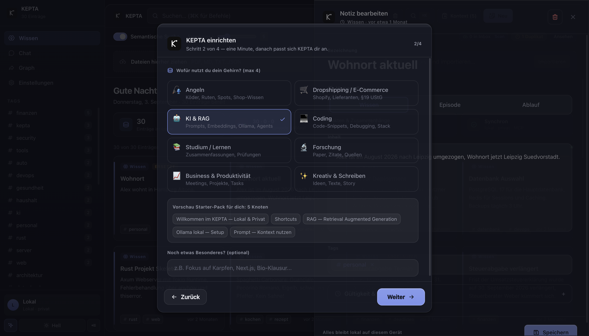
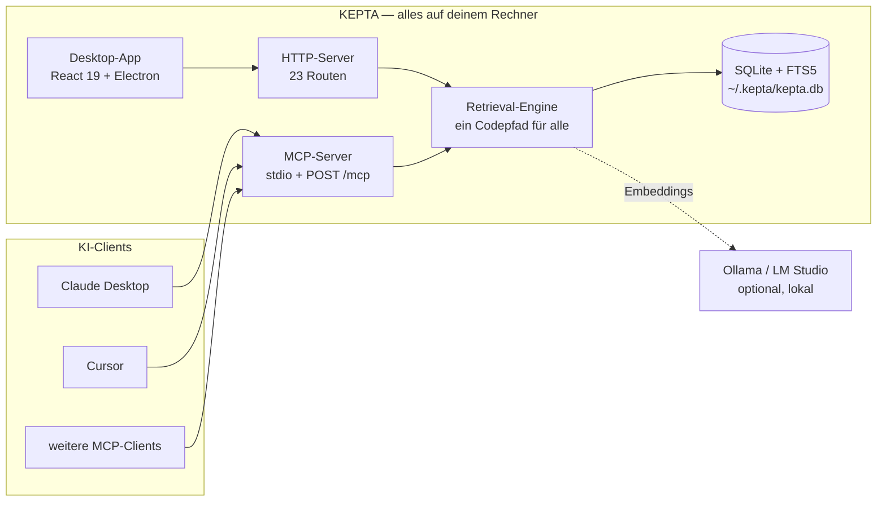
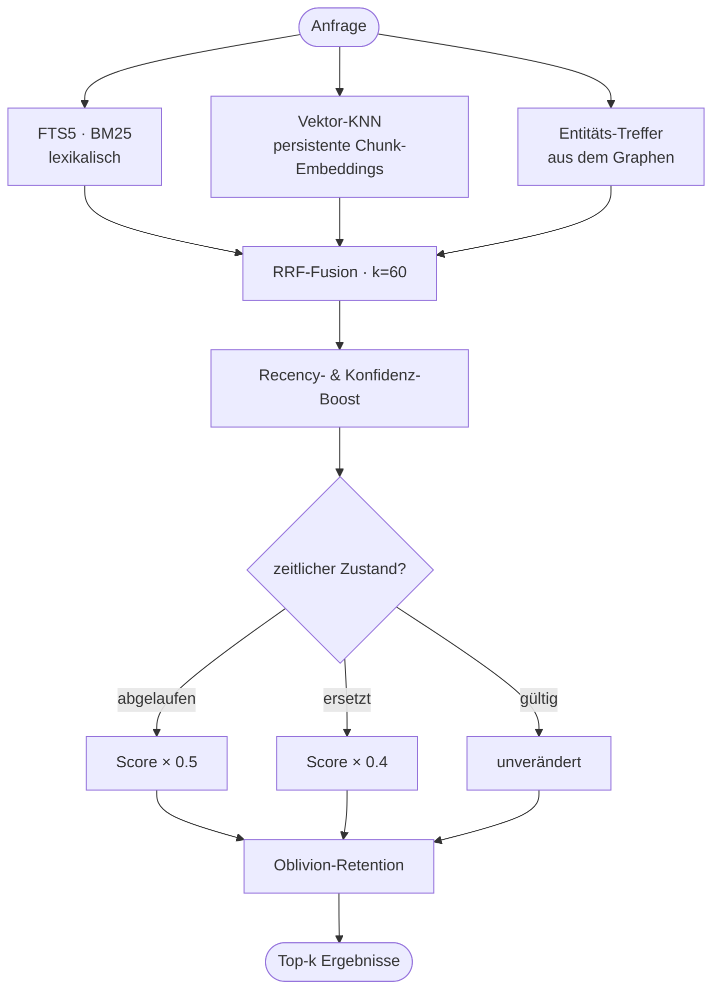

<p align="center"></p>
<h1 align="center">KEPTA — Behält, was zählt</h1>
<p align="center"><strong>Das lokale Gehirn für deine KI-Agenten. Ohne Cloud. Ohne Abo.</strong><br>SQLite + hybride Suche + Wissensgraph + MCP.</p>

<p align="center"><a href="https://github.com/DamianTodorovic/kepta/releases"></a> <a href="https://github.com/DamianTodorovic/kepta/actions/workflows/build.yml"></a>   <a href="LICENSE"></a> </p>

## 🎬 So sieht KEPTA aus

<p align="center"></p>

<sub>Tippen, filtern, öffnen — 30 Einträge werden zu einem Treffer. Aufgenommen aus Version 2.4.0.</sub>

| Index & hybride Suche | Wissensgraph |
|---|---|
|  |  |
| **Editor — Typ, Gültigkeit, Konfidenz** | **Einrichtung — Themen & Starter-Pack** |
|  |  |

<sub>Aufnahmen aus Version 2.4.0 mit dem Demo-Korpus aus <code>scripts/eval-corpus.ts</code>.</sub>

## 🎯 Use Cases

1. **Ein Gehirn für alle KI-Tools** — Claude Desktop, Cursor & Co. teilen dieselbe Wissensbasis per MCP. Was ein Agent lernt, weiß der nächste sofort.
2. **Agenten klug halten statt verrotten lassen** — Typ, Gültigkeit, Konfidenz; Widersprüche werden ersetzt (ERSETZT-Kette), Abgelaufenes markiert.
3. **Second Brain** — Notizen/Projekte/Wissen semantisch auffindbar („was koche ich mit Nudeln" findet das Rezept, sobald `ollama pull nomic-embed-text` einmal gelaufen ist; ohne Embedding-Modell sucht KEPTA rein lexikalisch weiter).
4. **Wissen ohne Friction** — Dateien reinziehen (PDF/MD/TXT), URLs clippen, Inbox-Ordner beobachten, Chat-Antworten speichern.
5. **Obsidian-Brücke** — Vault-Import/-Export (Markdown+Frontmatter); `[[Wiki-Links]]` werden zu Graph-Kanten.
6. **Privat** — alles lokal in `~/.kepta/`, MIT, kein Konto.
7. **Recherche** — Wissensgraph mit echten Verbindungen, Duplikat-Erkennung, Papierkorb mit Undo.
8. **Dev-Setup in 2 Minuten** — MCP-Config kopieren, `POST /mcp` (2026-07-28, 8 Tools), HTTP-API, `npm run eval` (Hit@1 92 %).

## 🏗️ Wie es zusammenhängt



Kein Dienst dazwischen, kein Konto, keine Telemetrie. Der Server lauscht ausschließlich auf `127.0.0.1`.

## 🔍 Wie die Suche entscheidet



Ohne Ollama läuft alles rein lexikalisch weiter — die Vektor-Spur entfällt, die Suche funktioniert.

## 🧩 Alle Funktionen

<details open>
<summary><strong>Erfassen &amp; Speichern</strong></summary>

- Notizen anlegen, bearbeiten, löschen — **Papierkorb statt Hard-Delete**, mit Wiederherstellen
- **Memory-Typen**: `semantic` (Fakten), `episodic` (Ereignisse), `procedural` (Abläufe)
- **Scope**: `user`, `agent`, `session` — trennt, wem eine Erinnerung gehört
- **Konfidenz** 0–1, frei vergebbare Tags, automatisch erkannte Entitäten
- **Zeitliche Gültigkeit**: `valid_from` / `valid_to`, abgelaufene Einträge werden markiert statt verschwiegen
- **Ersetzungsketten** (`superseded_by`): Widersprüche verdrängen einander, die Historie bleibt
- **Dateien** per Drag &amp; Drop: PDF, MD, TXT, JSON — Chunking bei 2000 Zeichen
- **URL-Clipper** mit SSRF-Schutz (IP-Literale in allen Schreibweisen, DNS-Auflösung, Redirect-Prüfung)
- **Auto-Learn** (standardmäßig **aus**): Auf Wunsch sichert KEPTA nach jeder Chat-Antwort die Kernaussage als Knoten (Tag `auto-learn`). Beim ersten Mal, wenn eine Antwort lernbar gewesen wäre, weist KEPTA einmalig darauf hin — mit Knopf zum Einschalten. Optionales kleines Extraktionsmodell, 45-Sekunden-Limit, Erfolg **und** Fehlschlag werden gemeldet
- **Inbox-Ordner** wird überwacht und automatisch eingelesen
- **Obsidian-Vault-Import**: Markdown + YAML-Frontmatter, `[[Wiki-Links]]` werden zu Graph-Kanten
- **Markdown-Export** nach `~/.kepta/export/`
- **Migration** aus der Vorgängerversion (`memories.json`) — idempotent, mit Backup

</details>

<details open>
<summary><strong>Suchen &amp; Abrufen</strong></summary>

- **Hybride Suche**: FTS5-BM25 + Vektor-KNN + Entitäts-Treffer, per RRF fusioniert
- **Persistente Embeddings** über Ollama (`nomic-embed-text`), Hintergrund-Queue statt Neuberechnung pro Anfrage
- **Temporale Gewichtung**: abgelaufen ×0.5, ersetzt ×0.4
- **Semantische Suche** abschaltbar, **Top-k** per Regler einstellbar
- **Ein Codepfad** für Oberfläche, HTTP-API und MCP — Agenten bekommen dieselbe Qualität wie du
- **Eval-Harness**: `npm run eval` misst Hit@1 und Precision@5 gegen ein Fixkorpus

</details>

<details open>
<summary><strong>Wissensgraph</strong></summary>

- Entitäten und Relationen aus `[[Wiki-Links]]` und automatischer Extraktion
- Kraftgerichtete Darstellung, Zoom, Knoten verschiebbar
- **Zeitregler** — zeigt den Wissensstand zu einem gewählten Zeitpunkt
- Farbcodierung nach Memory-Typ, Knotengröße nach Verbindungen
- Unterscheidung zwischen echter Verbindung und bloßer Ähnlichkeit
- Doppelklick öffnet die Notiz

</details>

<details open>
<summary><strong>Pflege &amp; Konsolidierung</strong></summary>

- **Duplikat-Erkennung** über Embedding-Ähnlichkeit (≥ 0.92), lexikalischer Fallback ohne Ollama
- **Konsolidierung** ersetzt statt zu löschen — nichts geht verloren
- **Auto-Tagging** neuer Einträge
- **Episodische Erinnerungen** entstehen aus Chat-Verläufen

</details>

<details open>
<summary><strong>Agenten-Anbindung (MCP)</strong></summary>

Protokoll `2026-07-28`, abwärtskompatibel zu `2025-06-18` und `2024-11-05`. Zwei Transporte: **stdio** und **Streamable HTTP** (`POST /mcp`). Alle acht Werkzeuge liefern `outputSchema` und `structuredContent`.

| Werkzeug | Zweck |
|---|---|
| `memory_search` | Hybride Suche mit temporaler Gewichtung |
| `memory_save` | Neu anlegen, inkl. Typ, Scope, Gültigkeit |
| `memory_update` | Bestehende Erinnerung ändern |
| `memory_delete` | In den Papierkorb verschieben |
| `memory_list` | Filtern nach Typ, Scope, Tags |
| `memory_graph` | Entitäten und Relationen abfragen |
| `memory_consolidate` | Duplikate finden und zusammenführen |
| `memory_forget` | Ablaufen lassen (`expire`) oder ersetzen (`supersede`) |

</details>

<details>
<summary><strong>Chat-Cockpit</strong> — Beweis-Modus, kein Feature-Magnet</summary>

- **20 Anbieter-Presets**: Ollama, LM Studio, OpenAI, Anthropic, Gemini, Mistral, Groq, DeepSeek, xAI, Perplexity, Together, Fireworks, Cohere, Cerebras, HuggingFace, Novita, OpenRouter, GitHub Models, Azure, eigener Endpunkt
- **Modell-Erkennung** für Ollama und LM Studio per Klick, ohne Schlüssel
- **SSE-Streaming** mit Stop-Taste, Markdown-Rendering
- **Quellen-Zitate**: jede Antwort zeigt, welche Erinnerungen sie benutzt hat
- **Datumsbewusstes Prompting** — das heutige Datum und Gültigkeits-Marker gehen in den Kontext
- **Token-Budget** sichtbar

Der Chat existiert, um Retrieval zu beweisen. Der Alltag läuft über MCP.

</details>

<details>
<summary><strong>Oberfläche</strong></summary>

- **Command Palette** (⌘K) für alles ohne Maus
- **Tag-Filter** mit Zählern, Mehrfachauswahl
- **Hell/Dunkel** und **Fokus-Modus**
- **Einrichtungs-Assistent** mit thematischem Starter-Pack
- **System-Status**: erkennt lokale KIs, prüft Speicher, zeigt Diagnose
- **Aktivitäts-Feed** über `/api/activity`
- Duplikat-Banner mit Direktsprung

</details>

<details>
<summary><strong>HTTP-API — 23 Routen</strong></summary>

| Bereich | Routen |
|---|---|
| Erinnerungen | `/api/memories`, `/api/memories/:id`, `/api/memories/:id/restore`, `/api/memories/search`, `/api/memories/import`, `/api/memory` |
| Suche &amp; Graph | `/api/search`, `/api/graph`, `/api/embed` |
| Import &amp; Export | `/api/import/markdown`, `/api/export/markdown`, `/api/clip` |
| Inbox | `/api/inbox/status`, `/api/inbox/scan` |
| Chat | `/api/chat`, `/api/chat/stream`, `/api/models` |
| MCP | `POST /mcp`, `/api/mcp/tools`, `/api/mcp/search`, `/api/mcp/save`, `/api/tools` |
| System | `/api/health`, `/api/storage-info`, `/api/activity`, `/api/profile` |

</details>

<details>
<summary><strong>Privatsphäre &amp; Härtung</strong></summary>

- Alle Daten in `~/.kepta/` — eine SQLite-Datei, die dir gehört
- Server bindet **nur auf `127.0.0.1`** (Override bewusst über `KEPTA_HOST`)
- **SSRF-Schutz** im URL-Clipper: normalisierte IP-Prüfung, DNS-Auflösung, jeder Redirect-Hop geprüft
- **Content-Security-Policy** in der Electron-Session, `nodeIntegration` aus, Sandbox an
- Rate-Limiting, Helmet, Eingabevalidierung auf allen Routen
- Kein Konto, keine Telemetrie, kein Phone-Home
- Ohne konfigurierte KI verlässt kein Byte den Rechner

</details>

## 🏢 KEPTA Enterprise — in Vorbereitung

> **Alles oben Genannte bleibt frei. Dauerhaft.** Keine Funktion, die je in der Community-Ausgabe war, wandert in eine kommerzielle. Der Strich bewegt sich nur in eine Richtung.

Es gibt einen Punkt, an dem lokales Gedächtnis aufhört, eine Privatsache zu sein: sobald eine **zweite Person** im Spiel ist — eine Kollegin, eine Mandantin, eine Prüferin. Dann reicht es nicht, dass die Daten den Rechner nicht verlassen. Man muss es **belegen** können.

Genau da setzt KEPTA Enterprise an. Der Grundsatz dahinter ist bewusst als Regel formuliert, nicht als Feature-Liste, damit auch künftige Funktionen vorhersagbar zugeordnet sind:

> Was ein Einzelner für sich selbst tut, ist frei.
> Was eine Organisation gegenüber Dritten verantworten muss, ist kommerziell.

**Woran gearbeitet wird**

| | |
|---|---|
| **Mehrere Arbeitsplätze** | Geteiltes und getrenntes Gedächtnis, Mandantentrennung, Ende-zu-Ende-verschlüsselte Replikation zwischen den Geräten einer Kanzlei — ohne fremden Server |
| **Nachweisbarkeit** | Manipulationsfestes Zugriffsprotokoll, erzwungene Löschfristen mit Löschnachweis, Ausgangsprotokoll: was ging wann an welches Modell |
| **Vertrauensinfrastruktur** | Verschlüsselung im Ruhezustand, signierte und notarisierte Installer, maschinenlesbare SBOM, TOM-Dokumentation |
| **Verbindlichkeit** | Zugesicherte Reaktionszeiten, benannter Ansprechpartner, Quellcode-Hinterlegung beim Treuhänder |
| **Wirtschaftlichkeit** | Kosten-Dashboard: eingesparte Tokens und Euro je Arbeitsplatz — die Rechnung, die lokales Gedächtnis erst rechtfertigt |

**Für wen** — Kanzleien, Praxen, Steuerberatungen, Forschungsgruppen und Ingenieurbüros im DACH-Raum. Überall dort, wo KI mit Gedächtnis gebraucht wird und die Daten das Haus nicht verlassen dürfen.

**Warum der Kern trotzdem offen bleibt** — wer belegen muss, dass nichts abfließt, soll das nachlesen können statt es zu glauben. Der geprüfte Kern ist mehr wert als ein Versprechen. Fällt der Anbieter aus, arbeitet der Kunde mit dem MIT-Kern weiter; bei proprietärer Software wäre an dieser Stelle Schluss.

**Interesse?** Öffne ein [Issue](https://github.com/DamianTodorovic/kepta/issues) mit dem Label `enterprise` oder schreib an `hello@kepta.app`. Der Preis wird mit den ersten Pilotkunden festgelegt, nicht vorher am Schreibtisch erfunden. Ein Termin steht noch nicht fest — was fehlt, sind keine Ideen, sondern Gespräche mit Leuten, die das wirklich brauchen.

## ⚡ Quick-Start

```bash
git clone https://github.com/DamianTodorovic/kepta.git && cd kepta
npm install && npm test && npm run eval
npm run dev        # http://localhost:3000
npm run electron   # Desktop-Shell (optional)
```

Fertige App: [Releases](https://github.com/DamianTodorovic/kepta/releases). Agent anbinden:

```json
{ "mcpServers": { "kepta": { "command": "node", "args": ["/PFAD/kepta/dist/mcp-server.cjs"] } } }
```

### 📦 Welche Datei brauche ich?

| Dein System | Datei |
|---|---|
| Mac mit Apple Silicon (M1–M4) | `KEPTA-<version>-mac-arm64.dmg` |
| Mac mit Intel-Prozessor | `KEPTA-<version>-mac-x64.dmg` |
| **Windows — im Zweifel dieses** | `KEPTA-<version>-win.exe` (enthält beide Architekturen) |
| Windows (Intel/AMD), kleinere Datei | `KEPTA-<version>-win-x64.exe` |
| Windows auf ARM, kleinere Datei | `KEPTA-<version>-win-arm64.exe` |
| Linux (Intel/AMD), jede Distribution | `KEPTA-<version>-linux-x86_64.AppImage` |
| Linux auf ARM | `KEPTA-<version>-linux-arm64.AppImage` |
| Debian, Ubuntu, Mint | `KEPTA-<version>-linux-amd64.deb` |

Jede Datei trägt Plattform und Architektur im Namen. Im Zweifel beim Mac: Apple-Menü → *Über diesen Mac* — „Apple M…" heißt `arm64`, „Intel" heißt `x64`. Die `.zip`-Dateien sind dieselben Programme ohne Installer. Die Pakete bringen alles mit; Node ≥ 22.5 brauchst du nur zum Selbstbauen.

### 🍎 Erster Start unter macOS

KEPTA wird ohne Apple-Entwicklerzertifikat gebaut — die Releases sind **nicht signiert und nicht notarisiert**. macOS setzt heruntergeladene Dateien deshalb in Quarantäne und meldet beim Doppelklick sinngemäß „kann nicht geöffnet werden, da der Entwickler nicht verifiziert werden kann". Die App ist in Ordnung; es fehlt nur die Signatur.

Einmalig freigeben, danach startet sie normal:

1. **Rechtsklick** auf `KEPTA.app` im Programme-Ordner → **Öffnen** → im Dialog erneut **Öffnen**.
2. Falls das nicht angeboten wird: *Systemeinstellungen → Datenschutz & Sicherheit* → bei der Meldung zu KEPTA auf **Dennoch öffnen**.

Alternativ im Terminal:

```bash
xattr -dr com.apple.quarantine /Applications/KEPTA.app
```

### 🪟 Erster Start unter Windows

Auch der Windows-Installer ist nicht signiert. SmartScreen meldet beim ersten Start „Der Computer wurde durch Windows geschützt". Einmalig freigeben: **Weitere Informationen** → **Trotzdem ausführen**.

### 🐧 Erster Start unter Linux

**AppImage** — ausführbar machen und starten, keine Installation nötig:

```bash
chmod +x KEPTA-*-linux-x86_64.AppImage
./KEPTA-*-linux-x86_64.AppImage
```

**deb** — für Debian, Ubuntu und Abkömmlinge:

```bash
sudo apt install ./KEPTA-*-linux-amd64.deb
```

Wer den Binärdateien nicht vertrauen will, baut selbst: `npm install && npm run build:mac`, `build:linux` oder `build:win` erzeugt die Pakete unter `release/`. Der Code ist MIT-lizenziert und vollständig einsehbar.

## 🧪 Qualität & Tests

**314 Tests**, Gesamt-Coverage **~91 %** (Kern `src/core` **100 % der Funktionen**). Vitest + v8-Coverage mit Schwellen als CI-Gate — jeder Commit, der die Abdeckung senkt, lässt die CI rot werden.

```bash
npm run lint       # tsc --noEmit (Typecheck)
npm test           # 314 Tests (vitest)
npm run test:cov   # Tests + Coverage-Gate
npm run eval       # Retrieval-Qualität (Hit@1)
```

| Schicht | Abdeckung | testet |
|---|---|---|
| `src/core` (Engine, Store, MCP, Migration) | ~98 % / **100 % Funcs** | Datenmodell, Suche, Konsolidierung, MCP-Protokoll |
| `src/lib` (Browser-Logik) | ~92 % | Provider-Presets, Profil, SSE, fetch-Client, Tokenizer |
| `server.ts` (HTTP + `/mcp`) | ~80 % | REST-Routen, MCP, Chat-Proxy, Import/Export |
| `src/components` (UI) | Kernkomponenten | Karten, Toast, Command-Palette |

Tests liegen in `tests/`, gespiegelt zur Quellstruktur. Neue Features nach TDD (RED → GREEN → REFACTOR).

## 🧠 Warum KEPTA?

Obsidian ist großartig für Menschen — aber Markdown ist kein Gedächtnis (keine Typen, Gültigkeit, kein MCP). Mem0/Letta sind SDKs ohne GUI. **KEPTA ist beides**: agent-native Memory-Schicht mit Desktop-App, lokal, MIT. Eval: Hit@1 **76 % → 92 %** vs. v1 (`npm run eval`).

Rollen-Logik: der **Test-Cockpit**-Chat beweist das Retrieval — der Alltag läuft über MCP. [ROADMAP](ROADMAP.md) · [CHANGELOG](CHANGELOG.md)

*EN — local-first brain for AI agents: shared MCP memory (2026-07-28, 8 typed tools), hybrid retrieval with persistent embeddings, knowledge graph, temporal validity, Obsidian interop. MIT, no cloud.*

**KEPTA** — gebaut für Fokus. Behält, was zählt.
