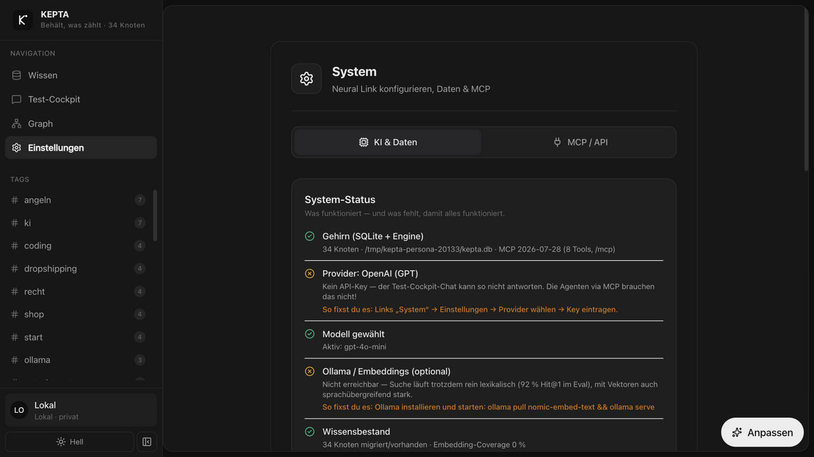

<p align="center"></p>
<h1 align="center">KEPTA — Behält, was zählt</h1>
<p align="center"><strong>Das lokale Gehirn für deine KI-Agenten. Ohne Cloud. Ohne Abo.</strong><br>SQLite + hybride Suche + Wissensgraph + MCP.</p>

<p align="center"><a href="https://github.com/DamianTodorovic/kepta/releases"></a> <a href="https://github.com/DamianTodorovic/kepta/actions/workflows/build.yml"></a>   <a href="LICENSE"></a> </p>

## 🎬 So sieht KEPTA aus

**Demo-Video:** [`docs/demo.webm`](docs/demo.webm)

| Index & hybride Suche | Wissensgraph |
|---|---|
|  |  |
| **Editor (Typ, Gültigkeit, Konfidenz)** | **System-Status (Setup-Diagnose)** |
|  |  |

## 🎯 Use Cases

1. **Ein Gehirn für alle KI-Tools** — Claude Desktop, Cursor & Co. teilen dieselbe Wissensbasis per MCP. Was ein Agent lernt, weiß der nächste sofort.
2. **Agenten klug halten statt verrotten lassen** — Typ, Gültigkeit, Konfidenz; Widersprüche werden ersetzt (ERSETZT-Kette), Abgelaufenes markiert.
3. **Second Brain** — Notizen/Projekte/Wissen semantisch auffindbar („was koche ich mit Nudeln" findet das Rezept).
4. **Wissen ohne Friction** — Dateien reinziehen (PDF/MD/TXT), URLs clippen, Inbox-Ordner beobachten, Chat-Antworten speichern.
5. **Obsidian-Brücke** — Vault-Import/-Export (Markdown+Frontmatter); `[[Wiki-Links]]` werden zu Graph-Kanten.
6. **Privat** — alles lokal in `~/.kepta/`, MIT, kein Konto.
7. **Recherche** — Wissensgraph mit echten Verbindungen, Duplikat-Erkennung, Papierkorb mit Undo.
8. **Dev-Setup in 2 Minuten** — MCP-Config kopieren, `POST /mcp` (2026-07-28, 8 Tools), HTTP-API, `npm run eval` (Hit@1 92 %).

## ⚡ Quick-Start

```bash
git clone https://github.com/DamianTodorovic/kepta.git && cd kepta
npm install && npm test && npm run eval
npm run dev        # http://localhost:3000
npm run electron   # Desktop-Shell (optional)
```

Fertige App: [Releases](https://github.com/DamianTodorovic/kepta/releases) (DMG/snap, Node ≥ 22.5). Agent anbinden:

```json
{ "mcpServers": { "kepta": { "command": "node", "args": ["/PFAD/kepta/dist/mcp-server.cjs"] } } }
```

### 🍎 Erster Start unter macOS

KEPTA wird ohne Apple-Entwicklerzertifikat gebaut — die Releases sind **nicht signiert und nicht notarisiert**. macOS setzt heruntergeladene Dateien deshalb in Quarantäne und meldet beim Doppelklick sinngemäß „kann nicht geöffnet werden, da der Entwickler nicht verifiziert werden kann". Die App ist in Ordnung; es fehlt nur die Signatur.

Einmalig freigeben, danach startet sie normal:

1. **Rechtsklick** auf `KEPTA.app` im Programme-Ordner → **Öffnen** → im Dialog erneut **Öffnen**.
2. Falls das nicht angeboten wird: *Systemeinstellungen → Datenschutz & Sicherheit* → bei der Meldung zu KEPTA auf **Dennoch öffnen**.

Alternativ im Terminal:

```bash
xattr -dr com.apple.quarantine /Applications/KEPTA.app
```

Wer der Binärdatei nicht vertrauen will, baut sie selbst: `npm install && npm run build:mac` erzeugt DMG und ZIP unter `release/`. Der Code ist MIT-lizenziert und vollständig einsehbar.

## 🧪 Qualität & Tests

**279 Tests**, Gesamt-Coverage **~91 %** (Kern `src/core` **100 % der Funktionen**). Vitest + v8-Coverage mit Schwellen als CI-Gate — jeder Commit, der die Abdeckung senkt, lässt die CI rot werden.

```bash
npm run lint       # tsc --noEmit (Typecheck)
npm test           # 279 Tests (vitest)
npm run test:cov   # Tests + Coverage-Gate
npm run eval       # Retrieval-Qualität (Hit@1)
```

| Schicht | Abdeckung | testet |
|---|---|---|
| `src/core` (Engine, Store, MCP, Migration) | ~98 % / **100 % Funcs** | Datenmodell, Suche, Konsolidierung, MCP-Protokoll |
| `src/lib` (Browser-Logik) | ~92 % | Provider-Presets, Profil, SSE, fetch-Client, Tokenizer |
| `server.ts` (HTTP + `/mcp`) | ~80 % | REST-Routen, MCP, Chat-Proxy, Import/Export |
| `src/components` (UI) | Kernkomponenten | Karten, Toast, Command-Palette |

Tests liegen in `tests/`, gespiegelt zur Quellstruktur. Neue Features nach TDD (RED → GREEN → REFACTOR).

## 🧠 Warum KEPTA?

Obsidian ist großartig für Menschen — aber Markdown ist kein Gedächtnis (keine Typen, Gültigkeit, kein MCP). Mem0/Letta sind SDKs ohne GUI. **KEPTA ist beides**: agent-native Memory-Schicht mit Desktop-App, lokal, MIT. Eval: Hit@1 **76 % → 92 %** vs. v1 (`npm run eval`).

Rollen-Logik: der **Test-Cockpit**-Chat beweist das Retrieval — der Alltag läuft über MCP. [ROADMAP](ROADMAP.md) · [CHANGELOG](CHANGELOG.md)

*EN — local-first brain for AI agents: shared MCP memory (2026-07-28, 8 typed tools), hybrid retrieval with persistent embeddings, knowledge graph, temporal validity, Obsidian interop. MIT, no cloud.*

**KEPTA** — gebaut für Fokus. Behält, was zählt.
