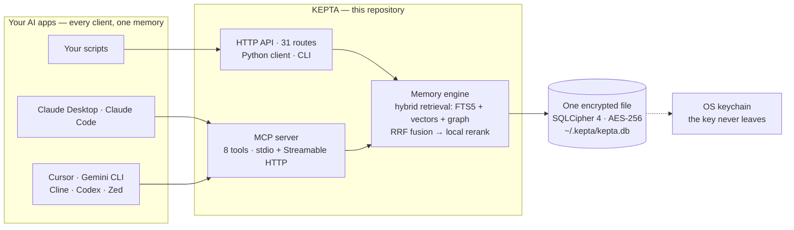
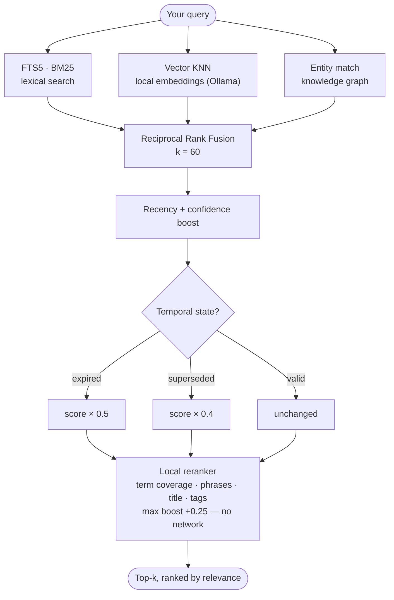

<p align="center"></p>
<p align="center">      <a href="https://www.linkedin.com/in/damian-todorovic-244235434"></a></p>

# KEPTA — the memory for AI systems

## Your AI forgets everything. Every chat starts from zero.

**KEPTA is the fix: one local, encrypted memory that every AI reads and writes — Claude, Cursor, Gemini CLI, Cline, any MCP client, and scripts over HTTP. No cloud. No account. One file you own.**

Everything an AI system learns goes into an encrypted knowledge base on your own computer — and every AI recalls it in milliseconds, however long the context grows. Documents, decisions, client knowledge, whole chat histories: remembered, linked, contradicted, superseded — never lost.

This repository is the **source-available core** (BUSL-1.1 — every line public, converts to AGPL-3.0-or-later four years after each release): the memory engine, the MCP server, the HTTP API — and the Python client, which is MIT so any Python project can embed it. **Everything that makes the memory smart lives in this free engine. There are no tiers inside the memory — nothing is held back to sell anything.**

Questions, security feedback or benchmark critique? → **[Discussions](https://github.com/DamianTodorovic/kepta/discussions)**


```mermaid
flowchart LR
  subgraph Apps["Your AI apps — every client, one memory"]
    direction TB
    A["Claude Desktop · Claude Code"]
    B["Cursor · Gemini CLI<br/>Cline · Codex · Zed"]
    C["Your scripts"]
  end
  subgraph KEPTA["KEPTA — this repository"]
    direction TB
    M["MCP server<br/>8 tools · stdio + Streamable HTTP"]
    G["HTTP API · 31 routes<br/>Python client · CLI"]
    E["Memory engine<br/>hybrid retrieval: FTS5 + vectors + graph<br/>RRF fusion → local rerank"]
  end
  D[("One encrypted file<br/>SQLCipher 4 · AES-256<br/>~/.kepta/kepta.db")]
  K["OS keychain<br/>the key never leaves"]
  A --> M
  B --> M
  C --> G
  G --> E
  M --> E
  E --> D
  D -.-> K
```

---

## ⚡ One command, every AI client

```bash
npx -y kepta-mcp setup   # connects Claude Desktop, Claude Code, Cursor, Windsurf, VS Code, Gemini CLI, Cline and Roo Code
npx -y kepta import chatgpt <export-folder>   # bring your ChatGPT history with you (export → extract → import)
npx -y kepta-mcp stats        # the terminal experience: remember, recall, timeline, contradict
```

Then tell your AI something worth keeping — and watch it arrive. Details in the [Quick start](#-quick-start).

---

---

## 🖥️ Or download the desktop app

KEPTA comes as a real desktop app — the same engine with a full interface: memory browser, hybrid search with retrieval provenance, knowledge graph, time travel, dossiers and a chat that reads the memory. Download the DMG for your Mac from the [latest release](https://github.com/DamianTodorovic/kepta/releases/latest) (Apple Silicon or Intel), drag it into Programs, right-click → **Open** once — macOS asks a single time because the app is ad-hoc signed, then never again.

The app is free, like everything in this repository. KEPTA Enterprise (team and tenant memory, audit chain, human review, point-in-time recovery) is licensed by agreement — [write to me on LinkedIn](https://www.linkedin.com/in/damian-todorovic-244235434).

## 🧠 One engine. Free. For every AI.

KEPTA is not a feature inside one app — it is a memory layer that outlives every model, every app and every context window. Three doors lead into the same encrypted file:

| Door | What uses it |
|---|---|
| **MCP** — 8 tools, stdio + Streamable HTTP | Every MCP client: Claude, Cursor, Gemini CLI, Cline, Codex, Zed, your own agents |
| **HTTP API** — 31 routes, loopback only | Scripts, cron jobs, agent teams, automations |
| **Python** — `pip install kepta`, standard library only | Any Python project, embedded |

**Free means free:** €0, forever, unlimited — no account, no daily limits, no key, nothing locked. The best memory engine we can build is the free one; that is the point.

**Teams and organizations** — shared team memory, central policies, MDM, organisation-wide audit — get **KEPTA Enterprise by request**. Coordination is the only thing we ever charge for; memory quality never is. → [write to me on LinkedIn](https://www.linkedin.com/in/damian-todorovic-244235434)

---

## ⚡ Quick start

### Connect your AI apps

```bash
npx -y kepta-mcp setup
```

Finds Claude Desktop, Claude Code, Cursor, Windsurf, VS Code, Gemini CLI, Cline and Roo Code on your computer and adds KEPTA to them. It asks per app (`--yes` connects all of them), keeps a backup of every file it changes and leaves every other entry alone. Zed, Codex CLI and Continue get the exact snippet to paste (their config formats move too fast to write from outside). Any other MCP client:

```json
{
  "mcpServers": {
    "kepta": {
      "command": "npx",
      "args": ["-y", "kepta-mcp"]
    }
  }
}
```

8 tools: `memory_search`, `memory_save`, `memory_update`, `memory_delete`, `memory_list`, `memory_graph`, `memory_consolidate`, `memory_forget`.

### HTTP API

```bash
git clone https://github.com/DamianTodorovic/kepta.git
cd kepta && npm install && npm run dev
# → http://127.0.0.1:3000

# save a note
curl -s localhost:3000/api/memory -H 'Content-Type: application/json' \
  -d '{"title":"Client Miller","content":"Billed quarterly.","tags":["client"]}'

# search
curl -s "localhost:3000/api/memories/search?q=how+does+miller+pay"
```

### Docker (MCP server only)

```bash
docker build -t kepta-mcp .
docker run -i -e KEPTA_DB_KEY=<64-hex> -v kepta-data:/data kepta-mcp
```

---

## ✨ What's inside

| | |
|---|---|
| 🔍 **Hybrid search** | BM25 full text + vector similarity (Ollama) + knowledge graph, fused with RRF, with local reranking |
| 🔐 **Encrypted at rest** | SQLCipher 4: AES-256 and an HMAC-SHA512 over every page, the WAL included; the key lives in the OS keychain (macOS Keychain, Windows DPAPI, Linux Secret Service) |
| 🕐 **Time travel** | Validity windows (`valid_from` / `valid_to`) and `asOf` queries — "what did I know on 3 March?" |
| ♻️ **Superseded, not contradicted** | New facts replace old ones (`superseded_by`); the history stays |
| 🔗 **MCP first** | 8 tools, one code path for the API and MCP — agents get the same quality as any client |
| 📄 **File import** | PDF (pdf.js with character maps), Markdown with `[[wiki links]]`, text, JSON |
| 📊 **Eval** | `npm run eval` on a fixed corpus of 58 notes / 45 queries: Hit@1, Precision@5, MRR, plus an ablation test per retrieval leg |

### How a query finds its answer


```mermaid
flowchart TD
  Q(["Your query"]) --> A["FTS5 · BM25<br/>lexical search"]
  Q --> B["Vector KNN<br/>local embeddings (Ollama)"]
  Q --> C["Entity match<br/>knowledge graph"]
  A --> R["Reciprocal Rank Fusion<br/>k = 60"]
  B --> R
  C --> R
  R --> BO["Recency + confidence boost"]
  BO --> T{"Temporal state?"}
  T -->|expired| X5["score × 0.5"]
  T -->|superseded| X4["score × 0.4"]
  T -->|valid| K1["unchanged"]
  X5 & X4 & K1 --> R2["Local reranker<br/>term coverage · phrases · title · tags<br/>max boost +0.25 — no network"]
  R2 --> OUT(["Top-k, ranked by relevance"])
```

---

## 🖥️ HTTP API (31 routes)

| Area | Routes |
|---|---|
| Memories | `GET/POST /api/memories`, `POST /api/memory`, `DELETE /api/memories/:id`, `POST /api/memories/:id/restore`, `POST /api/memories/bulk-delete`, `POST /api/memories/bulk-restore`, `POST /api/memories/reclassify`, `POST /api/memories/import` |
| Search & graph | `GET /api/memories/search`, `POST /api/search`, `GET /api/graph` |
| Import / export | `POST /api/import/markdown`, `POST /api/export/markdown` |
| Inbox | `GET /api/inbox/status`, `POST /api/inbox/scan` |
| Device Sync | `POST /api/sync/export`, `POST /api/sync/import`, `GET /api/sync/journal` |
| Encryption & repair | `GET /api/health` (including the `encryption` status), `POST /api/repair/imports` |
| MCP | `POST /mcp`, `GET /mcp`, `GET /api/mcp/tools`, `POST /api/mcp/search`, `POST /api/mcp/save`, `GET /api/tools`, `POST /api/embed` |
| System | `GET /api/settings`, `PUT /api/settings`, `GET /api/storage-info`, `GET /api/activity` |

Every route listens on `127.0.0.1` only, with rate limiting, Helmet and input validation.

---

## 🐍 Python client

```bash
pip install kepta
```

```python
from kepta import KeptaClient
kepta = KeptaClient()
kepta.save("Carbonara", "Guanciale, pecorino, egg yolk. No cream.", tags=["cooking"])
for hit in kepta.search("carbonara without cream"):
    print(f"{hit.score:.2f}  {hit.memory.title}")
```

No dependencies — only the Python standard library.

---

## 🏗️ Architecture

```
src/core/           memory engine (store, search, encryption, MCP protocol)
server.ts           HTTP API (Express, 31 routes)
src/mcp-server.ts   MCP stdio server (npx kepta-mcp) and the CLI (npx kepta)
src/ui/graph.ts     the graph builder behind the API and the CLI (no UI — the interface is your AI client)
npm/                source of the npm package (kepta-mcp)
Dockerfile          container for the MCP server
python/             Python client (PyPI: kepta)
scripts/            eval, benchmark, repair
tools/              benchmark harnesses (LongMemEval, latency)
tests/              Vitest suite with CI-enforced coverage thresholds
```

**One code path** for the HTTP API and the MCP server — agents get the same results as direct API calls.

---

## 🔐 Encryption

The knowledge base is a SQLCipher 4 database: AES-256, an HMAC-SHA512 over every page, the WAL included. The key — 256 random bits — lives in the operating system's keychain: the macOS Keychain, Windows DPAPI or the Linux Secret Service. On servers without a keychain, set `KEPTA_DB_KEY` to 64 hexadecimal characters. What it covers, what it does not, and how to keep a copy of the key: [SECURITY.md](SECURITY.md).

---

## 🧪 Quality

**425 tests** with Vitest and v8 coverage. The coverage thresholds are a CI gate: a commit that falls below one of them turns CI red. On top: a retrieval eval (Hit@1, Precision@5, MRR) on a fixed corpus, an ablation test per retrieval leg, an encryption eval and a boundary test on the core architecture.

### Coverage thresholds (enforced by CI)

| Area | Lines | Functions | Branches | Statements |
|---|---|---|---|---|
| together, inside the coverage scope | **70 %** | **72 %** | **56 %** | **66 %** |
| `src/core` | **87 %** | **89 %** | **74 %** | **85 %** |

Measured scope is `src/core/**` plus `server.ts` (`vitest.config.ts`) — the headless
core, which is the product. `tools/`, `scripts/`, `npm/` and `python/` have their own
suites but no threshold, so they are not inside these percentages.

### Latency — measured, public

Median search times on the same laptop (Apple M4), every run committed in [`tools/latenz/ergebnisse/`](tools/latenz/ergebnisse/): **46.6 ms** median at 100,000 memories (p95 87.6 ms), **276.5 ms** median at **1,000,000 memories**. Encrypted at rest the whole time.

### Benchmark record — LongMemEval-S, fully public

KEPTA ships its memory benchmark the way nobody else does: **every question, every answer and every judge verdict of every run is committed to this repository**, in [`tools/longmemeval/ergebnisse/`](tools/longmemeval/ergebnisse/). Fixed dataset (LongMemEval-S, 500 questions, SHA-pinned), fixed judge, fully reproducible locally — see [`tools/longmemeval/README.md`](tools/longmemeval/README.md).

The published score is **61.5 %** on LongMemEval-S — graded by a **local 14B judge** (`qwen2.5:14b`, Q4, runs on a consumer GPU), zero cloud. The 3B-judge series is fully committed as the continuity baseline: 29.2 → 32.5 → 33.2 → 37.0 → 39.0 — every step is a run record in the same folder, no new model, no cloud, no fine-tuning. Same retrieval pipeline, fairer grading: a stronger local judge measures what the 3B judge under-scored on long contexts. The 14B-judge chain on that same pipeline: 54.6 → 55.0 (HyDE-lite) → **61.5** (topk 32 + time-split + HyDE) — 96 % of Zep's cloud-judged 63.8 %, with zero cloud.

---

## 👋 Who builds KEPTA

KEPTA is built by **Damian Todorovic** and **Emil Wagner** — a small team from Germany, shipping in public. Questions, ideas, Enterprise for your team — or you simply want to follow where this is going: **[find us on LinkedIn](https://www.linkedin.com/in/damian-todorovic-244235434)**.

## 📄 License

[BUSL 1.1](LICENSE) — every line public, production use inside your own organization always allowed, offering it as a hosted service is reserved, and each version converts to AGPL-3.0-or-later four years after release. **The npm package `kepta-mcp` carries the same license as this repository; the Python client under `python/` stays MIT** so any Python project can embed it. KEPTA Enterprise for teams and organizations is licensed by agreement — [write to me on LinkedIn](https://www.linkedin.com/in/damian-todorovic-244235434).

**What this repository is — and what it is not.** This source-available core is the memory engine: storage, retrieval, MCP — free, for every AI. Forks are legitimate; presenting a fork as KEPTA is not: the **KEPTA name and the KEPTA branding belong to Damian Todorovic**. Fork it, build with it, ship your own product from it — under a different name, without offering this engine as a hosted service, and with every change you make becoming AGPL-3.0-or-later when the version's Change Date arrives. Private notes never leave KEPTA over MCP.

---

<p align="center">
  <sub>KEPTA — the best place to store knowledge for AI. Local, encrypted, free. No subscription, no account, no excuses.</sub>
</p>
